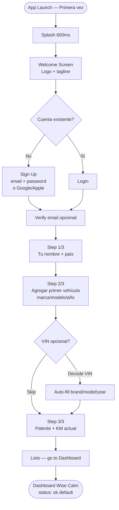
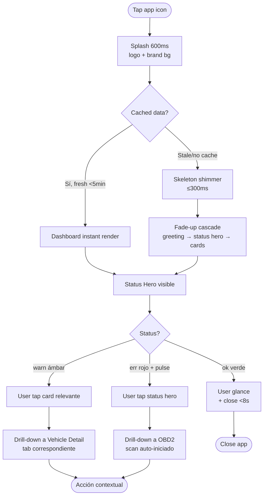
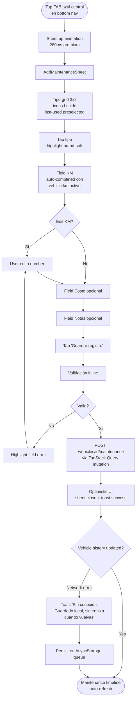
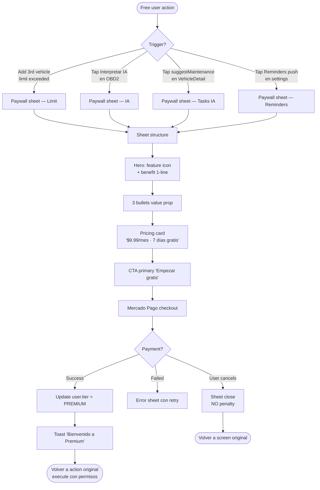

# UX Design Specification — Motora IA

**Author:** Dario
**Date:** 2026-04-25
**Project:** motora-ia
**Status:** Workflow iniciado — Discovery pending

---

_Este documento se construye colaborativamente paso a paso. Las decisiones de UX se agregan conforme avanzamos por las fases de discovery, definición y especificación visual._

_**Strategy:** Combinación de BMad UX Design (specs documentadas) + Claude Design (mockups visuales) — ver [architecture.md](architecture.md) para context completo._

---

## Executive Summary

### Project Vision

Motora es una plataforma multiplataforma que **consolida la experiencia automotriz** del dueño de auto: historia clínica digital del vehículo, gestor de mantenimiento, lector OBD2 en vivo, y descubrimiento de negocios locales — todo unificado con diagnósticos IA empáticos (persona "mecánico cordobés"). Tier dual **CLIENT** (FREE/PREMIUM) ↔ **BUSINESS** (Default/Plus) con switch de rol sin re-login.

**Posicionamiento:** Primera app local que combina historia + mantenimiento + OBD2 + descubrimiento de talleres con interfaz aproximable (no especializada).

### Target Users (3 Personas)

**Persona 1 — "Pablo Petrolhead"**
- Hombre técnico 28-45 (ingeniero, IT, aficionado automotriz)
- Busca **data automotriz detallada**: RPM curves, DTC codes, freeze frames, tendencias
- Power user PREMIUM, disfruta interpretar OBD2 él mismo
- Mood: *"quiero entender mi auto a fondo"*

**Persona 2 — "Mariana Práctica"**
- Dueña/dueño no-técnico 30-50 (mixto género)
- Busca **simplicidad y peace-of-mind**: estado del auto + reminders + documentación
- Foco en "¿está bien? ¿cuándo es la próxima ITV?" — no en data técnica
- Mood: *"no me hagas pensar como mecánico"*

**Persona 3 — "Carlos Mecánico"** (BUSINESS user)
- Taller independiente o multi-marca, 25-55, hombre
- Necesita **workflow rápido**: ver historia + diagnosticar + presupuestar
- Usa app **en taller** (datos móviles, prisa, manos posiblemente sucias)
- Mood: *"ahorrame 20 minutos por cliente"*

### AHA Moment

> "Es la primera app que entiende mi auto **completamente**: detecta problemas en lenguaje claro, tiene mis papeles digitales, mi historia de mantenimiento, y cuando algo se rompe, me dice qué taller cercano puede arreglarlo."

**Implicación UX:** Motora compite vs **fragmentación** (CarFax + WhatsApp del mecánico + Calendario para vencimientos + Google Maps). El AHA es **consolidación**.

### Pain Points Identificados

1. **Vacío de mercado local** — No existen apps locales que combinen los verticals automotrices
2. **Apps existentes son "duras"** — Diseñadas por/para especialistas (CarFax, Torque Pro, Drivvo)
3. **Interfaces feas** — No transmiten "premium" pese a ser de un dominio técnico

**Implicación UX:** Necesitamos **dignidad técnica + accesibilidad emocional**.

### Contexto de Uso

| Contexto | Lugar | Conectividad | Postura | Frecuencia |
|----------|-------|--------------|---------|------------|
| **Daily check** | Garage casa | Wifi | Two-handed, calmo | Varias veces/semana |
| **Recording maintenance** | Taller externo | Datos móviles | Rápido, posibles manos sucias | Ocasional |

**Implicación UX:** UI debe funcionar en ambos contextos: **profundidad en garage + agilidad en taller**.

### Brand Mood — "Garage Premium"

**Inspiración:** Tesla + Apple CarPlay + Linear

**Característica visual:**
- Dark mode dominante (alineado con paleta actual `#0F172A`)
- Acentos metálicos sutiles (gris frío, plateados)
- Tipografía bold + sans-serif técnica
- Animaciones suaves, no juguetonas
- Iconografía precisa (sin caricaturas)
- Confianza por **sofisticación**

**Tu paleta actual ya está en esa dirección** → necesita refinamiento, no overhaul.

### Key Design Challenges

1. **Tres personas con necesidades opuestas:** densidad técnica (Pablo) vs simplicidad (Mariana) vs velocidad (Carlos). Tensión: ¿UI única o adaptable?

2. **Densidad técnica vs Friendliness:** OBD2 telemetría es inherentemente técnica (RPM, °C, voltage, DTC codes). Tensión: mostrar todo (Petrolhead) sin abrumar (Mariana).

3. **Premium feel + Empathetic IA:** Tesla-cool es premium pero puede ser frío. La persona IA es empática (mecánico cordobés). Tensión: hardware-aesthetic + warmth tonal.

4. **Multi-context UX (garage ↔ taller):** Mismo user, diferentes manos, diferente luz, diferente prisa. Tensión: interface optimizada para ambos sin tradeoffs.

5. **Switch CLIENT ↔ BUSINESS sin confusión:** El mismo user puede ser dueño + mecánico. La UI cambia drásticamente entre roles. Tensión: branding consistente, funcionalidad muy diferente.

### Key Design Opportunities

1. **Progressive Disclosure por User Type:** Default UI simple (Mariana mode) con toggle "Pro Mode" para revelar densidad técnica (Petrolhead). Reduce abrumamiento sin limitar power users.

2. **Dashboard "Cinematográfico" HUD-style:** Reinventar visualización OBD2 — en lugar de tablas, **gauges animados estilo cuadro de auto** (RPM dial, temp gauge, fuel-level). Premium feel + entendible.

3. **Mecánico Cordobés con presencia visual sutil:** La IA tiene voz empática — darle presencia visual sutil (avatar minimalista, color púrpura PREMIUM, tone visual cálido cuando habla). Humanización sin caricatura.

4. **"Quick Capture" mode para BUSINESS:** Modo simplificado para Carlos — 2-tap maintenance entry, OBD2 scanner que prioriza speed sobre prettiness. UI role-aware sin rebuild completo.

5. **"Trust by Transparency":** Cards visuales con historia completa + timeline + iconografía clara (vs spreadsheets de competencia). Diferencial visible al primer vistazo.

### Competitive Landscape

| Competidor | Fortaleza | Debilidad |
|------------|-----------|-----------|
| **CarFax** | Historia vehicular completa | Solo USA, no integra OBD2 ni mantenimiento personal |
| **Drivvo** | Tracking de gastos | UI dura, sin OBD2 ni IA |
| **Torque Pro** | Lectura OBD2 técnica | Solo OBD2, UI para especialistas, sin historia |
| **Google Maps** | Descubrimiento de talleres | No integra contexto del auto |
| **WhatsApp del mecánico** | Cercanía | Sin historial, sin estructura |

**Diferencial Motora:** Consolidación + Accesibilidad + IA empática local + Aesthetic premium

---

## Core User Experience

### Defining Experience — Dual Pattern

**Entry Loop (alta frecuencia, daily/weekly):**
"Peace-of-mind Dashboard" — User abre la app y en 2 segundos sabe el estado de su auto: ¿algo urgente? ¿qué documentos vencen pronto? ¿último mantenimiento? Foco: glanceable, visualmente jerárquico, calmo cuando todo está bien.

**Engagement Loop (cuando hay diagnóstico, ocasional):**
"OBD2 + IA Empática" — User conecta ELM327 → escanea → recibe diagnóstico narrativo del "mecánico cordobés" con urgencia + acción justificada por desgaste real. Foco: profundo, narrativo, transformacional.

**Implicación de diseño:** Dashboard prioriza claridad instantánea (3s máximo). OBD2 puede tomar tiempo y atención porque es el momento de mayor valor agregado.

### Platform Strategy

| Plataforma | Rol | Stack |
|------------|-----|-------|
| **Mobile (PRIMARY)** | 95% UX, todos los flows CLIENT/BUSINESS | React Native + Expo (iOS + Android) |
| **Web (SECONDARY)** | Admin dashboard + KPIs internos | Vite React + TypeScript |
| **Public Web** | Landing + términos + privacidad | Vite React (modules/landing) |

**Offline Strategy: P1 — Offline mínimo**
- Viewing de data cacheada (vehículos, mantenimiento, historia OBD2) funciona sin red
- Editing/mutations requieren conexión → bloquean con toast claro
- TanStack Query staleTime de 5min cubre la mayoría de re-aperturas
- Sin sync queue compleja (no es prioridad MVP)

**Postura de uso:** Touch-based, two-handed default. Quick Capture mode disponible para taller (Carlos) con touch targets más grandes y workflow simplificado.

### Effortless Interactions — Top 3 Priorizados

**#1 PRIORIDAD MÁXIMA — "Saber si todo está bien al abrir la app"**
- Implementación: Splash → Dashboard con status semáforo dominante (verde/amarillo/rojo)
- Cards consolidadas: vehículo activo + último diagnóstico + próximo vencimiento
- Cero pensamiento: el user sabe en 2 segundos si necesita actuar
- Persona target: Mariana (default), también beneficia a Pablo y Carlos

**#2 PRIORIDAD ALTA — "Agregar mantenimiento en <30s"**
- Implementación: 1 tap "Agregar" → tipo preselected (último) → KM auto-completado → costo opcional → guardar
- Cero fricción de captura, formulario inteligente con defaults
- Persona target: Carlos (taller), Mariana (después de visita al mecánico)

**#3 PRIORIDAD MEDIA — "Switch CLIENT ↔ BUSINESS sin friction"**
- Implementación: 1 tap en avatar/header → toggle de rol → UI cambia sin re-login
- Estado `activeRole` persiste en AsyncStorage
- Persona target: Carlos (mecánico que también es dueño)

**Deferred a post-MVP (importantes pero no top 3):**
- Reminders push automáticos antes de vencimientos (crítico para retención, ya en backlog)
- OBD2 reconnect sin re-pairing (mejora UX Pablo, requiere persistir address Bluetooth)

### Critical Success Moments

| # | Momento | Make Condition | Break Condition |
|---|---------|----------------|-----------------|
| 1 | **Onboarding 3/3** | Primer auto en <90s, validación clara | Errores opacos, demasiados campos |
| 2 | **Primera conexión OBD2 exitosa** | Loading states claros, fallback con mock visible | Timeouts sin info, errores Bluetooth crípticos |
| 3 | **Primera lectura "mecánico cordobés"** | Tono argentino auténtico, justificación con piezas reales | "El código P0301 indica falla cilindro 1" (frío) |
| 4 | **Trigger upgrade PREMIUM** | Valor explicado + contexto, sin dark patterns | Paywall agresivo sin justificación |
| 5 | **Reconexión semana 2+** | "Lo último que hiciste fue X, te recomendamos Y" | Dashboard estático ("nada nuevo aquí") |

### Experience Principles

**1. Friendly Tech, no Tech Speak**
- Datos técnicos siempre con contexto humano (RPM con label "régimen del motor")
- DTC sin traducción IA = inaceptable
- Densidad técnica disponible vía toggle, nunca obligatoria

**2. Calm by Default, Power on Demand**
- Default UI: Mariana mode (resumen, semáforo, calma)
- Toggle "Pro Mode": gauges, tendencias, freeze frames detallados
- Mismo app, dos densidades adaptables

**3. Premium feels, never frío**
- Aesthetic: Tesla + Apple CarPlay (dark, metallic, technical)
- Narrative: Mecánico cordobés (cálido, empático, justificado)
- Tensión productiva: visual sofisticado + tono humano

**4. Trust by Transparency**
- Mostrar historia completa, evidencia visual, timestamps reales
- Combatir frustración "no sé si me están timando"
- Cards visuales > spreadsheets

**5. Two-handed Garage / One-handed Workshop**
- Toda interacción funciona en ambos contextos
- Touch targets mínimo 44pt
- Quick Capture mode para situaciones de prisa

---

## Desired Emotional Response

### Primary Emotional Goal — "Control Tranquilo"

> "Tengo el control completo de la salud de mi auto. No me sorprende nada — sé qué pasa, cuándo pasa, y qué hacer. **No vivo con ansiedad por mi auto.**"

Mezcla equilibrada de:
- **Dominio** (Pablo: "entiendo profundamente")
- **Paz mental** (Mariana: "no me preocupo")
- **Eficiencia** (Carlos: "no pierdo tiempo")

**Diferencial vs competidores:** Apps existentes generan ansiedad técnica (Torque Pro) o sobrecarga organizacional (Drivvo). Motora promete **calma activa**.

### Emotional Journey Map

| Momento | Emoción Deseada | Diseño |
|---------|-----------------|--------|
| **Discovery (primer contacto)** | Curiosidad respetada | "Esto se ve serio, profesional" — confianza visual desde el primer pixel |
| **Onboarding** | Progreso satisfactorio | Cada paso me acerca, sin fricción — barra visible, "casi listo" |
| **Daily Open** | Tranquilidad inmediata | Verde = todo bien, puedo cerrar — 2s = veredicto claro |
| **Diagnóstico OBD2** | Comprensión iluminadora | "Ah, entonces ESO es lo que pasa" — narrativa empática + acción clara |
| **Error State** | Frustración mitigada | "Lo arreglo en 1 paso, no me asusta" — errores en lenguaje humano |
| **Reconexión (semana 2+)** | Reconocimiento + Continuidad | "Esta app me conoce, retomé donde dejé" — cards reflejan contexto |

### Micro-Emotions Críticas

| Micro-Emoción | Por qué es Clave | UX Implementation |
|---------------|------------------|-------------------|
| **Confianza** | Data sensible (auto = patrimonio) | Visual sólido, transparencia, sin sorpresas |
| **Competencia** | OBD2 puede intimidar a Mariana | Lenguaje accesible, defaults inteligentes |
| **Premium** | Diferenciador vs apps "feas" | Animaciones suaves, tipografía cuidada, no caricaturas |
| **Progreso** | Mantenimiento = hábito a construir | Streaks visuales sutiles, timeline siempre creciendo |
| **Pertenencia** | Identidad local cordobés/argentino | Lenguaje regional auténtico, descubrimiento de talleres locales |
| **Anticipación positiva** | Trigger para reaperturas | Reminders amigables, "te recomendamos…" no "tenés que…" |

**Micro-emociones a EVITAR:**
- 🚫 **Ansiedad** — "tu auto puede explotar" (drama innecesario)
- 🚫 **Culpa** — "no registraste mantenimiento en 30 días" (shaming)
- 🚫 **Sobrecarga** — "revisá estos 47 datos" (overload técnico)
- 🚫 **Trampa** — "upgrade ahora o pierdes todo" (dark patterns)

### Emotion → Design Connections

| Emoción Deseada | Decisión UX |
|----------------|-------------|
| **Control Tranquilo** | Dashboard semáforo gigante (verde default, amarillo/rojo solo cuando importa) |
| **Confianza** | Timestamps reales ("Editado hace 2 horas") + historial completo visible |
| **Premium** | Animaciones spring (no bouncy), transiciones 200-300ms, NO confetti/celebraciones infantiles |
| **Competencia** | Tooltips opt-in junto a DTCs, IA traduce automáticamente, "Pro Mode" off por default |
| **Pertenencia** | Lenguaje cordobés en IA + naming de marcas locales (Renault Argentina, Fiat regionales) |
| **Progreso** | Timeline de mantenimiento siempre creciendo, milestones sutiles ("100 días con tu auto registrado") |
| **Anticipación positiva** | Reminders 7 días antes con tono amigable: "Che, tu seguro vence el martes" |
| **Comprensión iluminadora** | IA siempre responde con: (1) qué pasa (2) qué hacer (3) cuán urgente |

### Emotional Design Principles

**EP1 — "Mostrar verdad, no alarma"**
- Si el auto tiene problema, decirlo claro pero sin drama
- Jerarquía: Verde > Amarillo > Rojo (semáforo, no fuegos artificiales)
- Tone IA: directo + empático, NO apocalíptico
- *Ejemplo MAL:* "⚠️ ATENCIÓN: PROBLEMA CRÍTICO DETECTADO"
- *Ejemplo BIEN:* "Tu auto reportó un código relacionado con el cilindro 1. No es urgente, pero conviene revisarlo este mes"

**EP2 — "Celebrar progreso, no perseguir engagement"**
- NO gamification artificial (badges sin sentido, streaks que generan culpa)
- SÍ feedback positivo cuando user actúa: "Mantenimiento registrado. Próximo cambio aceite: en 5,000 km"
- Métrica del éxito = retención por valor, no por compulsión
- NUNCA usar dark patterns: notificaciones culposas, FOMO artificial, manipulación emocional

**EP3 — "Cordobés sin caricaturizar"**
- IA habla "como un mecánico de Córdoba": directo, empático, justifica con piezas reales
- NO clichés vulgares: "che boludo, tu auto está jodido"
- SÍ autenticidad respetuosa: "Mirá, este código P0301 indica falla en el cilindro 1 — generalmente es la bobina o la bujía. Te recomiendo revisar antes que se ponga peor"
- Tono = vecino que sabe, no robot ni standup comedian

### Design Anti-Patterns Identificados

Lo que Motora **NO** debe hacer (común en competidores):

1. **CarFax-syndrome:** Reportes legalistas en PDF que nadie lee → Motora muestra cards visuales
2. **Drivvo-overload:** 47 campos para registrar un mantenimiento → Motora usa defaults inteligentes (3 campos críticos)
3. **Torque Pro-coldness:** "P0301: Cylinder 1 Misfire Detected" → Motora lo traduce empático
4. **Duolingo-infantil:** Mascotas, confetti, fuegos artificiales → Motora celebra con discreción técnica
5. **Banking app-paranoia:** "Confirmar acción crítica" en 3 pasos para todo → Motora confirma solo lo destructivo

---

## UX Pattern Analysis & Inspiration

### Constraint Visual Clave

> **"Simple pero sofisticado — NO 3D."**

Tomamos inspiración del lado minimalista/premium de cada app. Cards 2D limpias > visualizaciones 3D. Densidad inteligente > dashboards saturados.

### Inspiring Products Analysis (10 apps validadas)

#### 1. Tesla App — *Status premium minimalista*
- ✅ **Adopt:** Status semáforo gigante (charge → status del auto), iconografía mecánica precisa, dark theme premium
- ✅ **Adapt:** Cards de "vehicle health" simplificadas a 2D
- ❌ **Skip:** Render 3D del auto, animaciones complejas

#### 2. Apple CarPlay — *Touch ergonomía automotriz*
- ✅ **Adopt:** Touch targets generosos (44pt+), tipografía SF Pro densa, modo oscuro automotriz
- ✅ **Adapt:** Layout de Quick Capture mode (Carlos)
- ❌ **Skip:** Bottom-only navigation (no aplica a app full-screen)

#### 3. Linear — *Pro tools dark mode*
- ✅ **Adopt:** Animaciones spring sutiles 200-300ms, dark mode técnico, jerarquía visual densa
- ✅ **Adapt:** Cards con metadata + acciones inline (mantenimiento, tareas)
- ❌ **Skip:** Comando CMD+K (no aplica mobile)

#### 4. Datadog — *Monitoring + color coding*
- ✅ **Adopt:** Color coding semántico (verde/amarillo/rojo consistente), drill-down progressive
- ✅ **Adapt:** Live Telemetry OBD2 con gauges 2D minimalistas
- ❌ **Skip:** Dashboards multi-pane (over-engineered para mobile)

#### 5. Things 3 / Notion — *Quick capture inteligente*
- ✅ **Adopt:** Quick capture con defaults inteligentes, mínima fricción
- ✅ **Adapt:** Flow de "Agregar mantenimiento <30s"
- ❌ **Skip:** Database flexibility (Motora tiene schema fijo)

#### 6. Apple Health — *Timeline visual de eventos*
- ✅ **Adopt:** Timeline visual de eventos, cards con info clave
- ✅ **Adapt:** Timeline de mantenimiento (historia clínica del auto)
- ❌ **Skip:** Charts médicos complejos (no aplica al dominio)

#### 7. Stripe Dashboard — *B2B premium serio*
- ✅ **Adopt:** Layouts limpios con data financiera, tonalidad seria
- ✅ **Adapt:** BUSINESS dashboard (Carlos) + Admin web dashboard
- ❌ **Skip:** Density alta de tablas (over-engineered para mobile)

#### 8. Mercado Pago — *Tono argentino profesional*
- ✅ **Adopt:** Tone friendly + profesional argentino, cards de transacción claras
- ✅ **Adapt:** Tono de copy + paywall + flow de pago (es nuestra pasarela)
- ❌ **Skip:** Branding amarillo MP (mantenemos paleta Motora)

#### 9. Rappi / PedidosYa — *Geo-discovery local*
- ✅ **Adopt:** Búsqueda geográfica, cards de comercios con info clave (rating + distancia + tiempo)
- ✅ **Adapt:** Discovery de talleres (BUSINESS profiles + appointment booking)
- ❌ **Skip:** Carrito + checkout flow (Motora no es e-commerce)

#### 10. Wise ⭐ — *Premium accesible (referencia ancla)*
- ✅ **Adopt:** Cards minimalistas + tipografía cuidada + color usage inteligente
- ✅ **Adopt:** Tono friendly pero pro (no infantil, no frío)
- ✅ **Adopt:** Empty states amigables ("aún no tenés transferencias" → CTA claro)
- ✅ **Adapt:** Estructura de cards con leading icon + title + metadata + chevron
- 🔥 **CLAVE:** Wise = "premium accesible" exactamente lo que Motora necesita

### Pattern de Inspiración Cross-Categoría

| Categoría | Apps | Aporte |
|-----------|------|--------|
| **Automotive** | Tesla, CarPlay | Visual hero + touch ergonomía |
| **Pro Tools** | Linear, Datadog, Things | Densidad técnica + capture flows |
| **Premium Consumer** | Apple Health, Stripe, Wise | Cards + tipografía + tone |
| **Latam** | Mercado Pago, Rappi | Tono argentino + geo-discovery |

**Decisión clave:** Cuando hay tensión entre "premium frío" (Tesla) y "accesible cálido" (Wise), gana **Wise**. Motora compite contra fragmentación + apps duras, no contra Tesla.

### Transferable UX Patterns Extraídos

**Navigation Patterns:**
1. Bottom Tabs (4 secciones max) — CarPlay, Wise, Linear → Mobile, Vehicles, Diagnostics, Profile
2. Drill-down progressive — Datadog, Apple Health → Dashboard → Detalle vehículo → Detalle de entrada
3. Avatar + Toggle — Wise (currency switch) → Switch CLIENT ↔ BUSINESS

**Interaction Patterns:**
1. Quick capture flows — Things 3 → Agregar mantenimiento con defaults
2. Pull-to-refresh contextual — Linear → Refresh vehicles list
3. Long-press para acciones secundarias — Wise → Editar/eliminar entry
4. Modal bottom-sheet para edits — Wise, Mercado Pago → EditFormModal (ya existe)

**Visual Patterns:**
1. Status hero card — Tesla, Apple Health → Dashboard semáforo
2. Timeline cards verticales — Apple Health, Wise → Mantenimiento history
3. Empty states amigables — Wise → "Aún no registraste mantenimientos"
4. Loading skeleton states — Linear, Wise → No spinners genéricos
5. Color coding semántico — Datadog, Wise → Verde/amarillo/rojo consistente

**Tone & Copy Patterns:**
1. Tono argentino profesional — Mercado Pago → "Tu próximo turno", "Tenés"
2. Empathy en errores — Wise → "Algo salió mal, vamos a intentarlo de nuevo"
3. Action-oriented CTAs — Linear → "Agregar mantenimiento" no "Crear nuevo"

**Data Density Patterns:**
1. Default low + Expand for more — Wise (cards collapsed) → Mariana mode
2. Pro Mode toggle — Linear → Dashboard simple ↔ telemetry detallada
3. Inline metadata sutil — Wise → "Hace 2 días · $4.500"

### Anti-Patterns a Evitar

**De competidores automotrices:**
1. **CarFax-syndrome:** PDFs legalistas que nadie lee → cards visuales
2. **Drivvo-overload:** 47 campos por entrada → 3 críticos + opcionales escondidos
3. **Torque Pro-coldness:** "P0301: Misfire" → traducción IA empática siempre
4. **Hum dashboards genéricos:** Lookalikes "smartwatch automotriz" → dashboard único Motora

**De UX en general:**
5. **Duolingo-infantil:** Mascotas, confetti, "¡Buen trabajo!" → Discreción técnica
6. **Banking-paranoia:** Confirmar todo en 3 pasos → Confirmar solo lo destructivo
7. **Slack-overload:** Notifications constantes → Reminders relevantes solamente
8. **Instagram-engagement:** Pull-to-refresh adictivo → Refresh por intención del user

**Específicas para "Garage Premium" (constraint Dario):**
9. **3D rendering del auto** → Ilustraciones 2D simples
10. **Skeumorfismo pesado** (gauges con shadows realistas) → Gauges flat con detalle sutil
11. **Caricaturas mecánicas** (llave inglesa con cara) → Iconografía precisa Lucide
12. **Gamification artificial** (badges sin valor) → Milestones contextual sutiles

### Design Inspiration Strategy — Matriz Final

| Aspecto | Adopt | Adapt | Avoid |
|---------|-------|-------|-------|
| **Cards** | Wise (clean + metadata) | Apple Health (timeline) | Drivvo (campos overload) |
| **Dashboard** | Tesla (status hero) | Datadog (color coding) | 3D rendering |
| **Density** | Linear (Pro Mode) | Wise (collapse default) | CarFax (PDF reports) |
| **Animations** | Linear (spring sutil) | CarPlay (transitions) | Bouncy/playful |
| **Color palette** | Existente (#0F172A) | Wise (semantic colors) | Mercado Pago amarillo |
| **Typography** | SF Pro / system | Linear (técnica densa) | Decorativas/scripts |
| **Tone copy** | Mercado Pago (argentino pro) | Wise (friendly+pro) | Duolingo (infantil) |
| **Iconografía** | Lucide (ya en uso) | Linear (precisa) | Caricaturas |
| **Empty states** | Wise (amigable + CTA) | — | Genéricos sin acción |
| **Errors** | Wise (empathy) | — | "Error 500" técnico |

**Wise como referencia ancla:** Cuando el equipo dude "¿esto es demasiado frío o demasiado playful?", la pregunta correcta es: "¿Wise lo haría así?". Si Wise dice sí, Motora dice sí.

---

## Design System Foundation

### Approach: Custom Tokens + Composable Primitives

Motora adopta un sistema de diseño **híbrido**: design tokens custom (semántica única para "Garage Premium") + primitives composables (Card, Stack, StatusIndicator, Gauge) + NativeWind/TailwindCSS como utility layer.

**Por qué esta opción (vs Material, vs library cross-platform):**
- Brownfield-friendly: respeta inversión existente (AppInput, AppSelect, modals)
- Identidad única: tokens custom para "Garage Premium" (no genérico)
- Cross-platform consistency: tokens compartidos mobile ↔ web
- Sin lock-in: tokens son portables, no dependencia de library externa
- Alineado con architecture decisions (monorepo workspaces, TailwindCSS web)

### Estructura del Sistema

**Package compartido:** `packages/design-tokens/`
- Workspace en monorepo (paralelo a `packages/types/` y `packages/scripts/`)
- Source of truth para colors, typography, spacing, radii, shadows, animations
- Consumido por mobile/ y web/ vía tokens importados

**Mobile consume tokens vía:**
- `mobile/src/shared/theme/` (RN-specific extensions)
- NativeWind config con tokens
- Components primitives en `mobile/src/shared/components/primitives/`

**Web consume tokens vía:**
- `web/src/shared/theme/tailwind.css`
- TailwindCSS config con tokens
- Primitives en `web/src/shared/components/primitives/`

### Design Tokens Definidos

**Colors (semantic, dark theme):**
```typescript
{
  background: { primary: '#0F172A', secondary: '#1E293B', elevated: '#262F45' },
  border: { default: '#334155', strong: '#475569', subtle: '#1E293B' },
  text: { heading: '#F8FAFC', body: '#CBD5E1', subtitle: '#94A3B8', muted: '#64748B', disabled: '#475569' },
  status: { success: '#34D399', warning: '#F59E0B', error: '#EF4444', info: '#3B82F6', premium: '#A855F7' },
  brand: { primary: '#3B82F6', metallic: '#94A3B8', accent: '#A855F7' }
}
```

**Typography:**
- Familia base: **Inter** (Google Fonts, opensource, full Latin support)
- Familia mono: **JetBrains Mono** (DTC codes, RPM values, datos técnicos)
- Sizes: xs (11) → sm (13) → base (15) → lg (17) → xl (22) → 2xl (28) → 3xl (34) → 4xl (48 — hero numbers)
- Weights: regular (400), medium (500), semibold (600), bold (700)
- Line heights: tight (1.1), normal (1.4), relaxed (1.6)

**Spacing:** Base 4pt scale (Tailwind-aligned, curated)
- 0, 1 (4px), 2 (8px), 3 (12px), 4 (16px — base padding), 5 (20px), 6 (24px), 8 (32px), 10 (40px), 12 (48px), 16 (64px — hero spacing)

**Radii:** sm (4), default (8), lg (12), xl (16), 2xl (24), full (9999)

**Shadows:** sm, default, lg, xl (premium elevation)

**Animations:**
- Spring configs (sutiles, no bouncy)
- Durations: instant (100), fast (200), normal (300), slow (500)

### Implementation Approach

**Phase 1 — Tokens Foundation (blocking):**
1. Create `packages/design-tokens/` workspace
2. Define tokens (colors, typography, spacing, radii, shadows, animations)
3. Setup NativeWind config (mobile) consuming tokens
4. Setup TailwindCSS config (web) consuming tokens
5. Add Inter + JetBrains Mono fonts (Expo Google Fonts plugin + web @import)

**Phase 2 — Primitives:**
6. Build primitives en mobile (Card, StatusIndicator, Gauge, Stack, Box, Text)
7. Build primitives en web (mismas APIs, version web)
8. Refactor existing components (AppInput, AppSelect) to consume tokens (no breaking changes)

**Phase 3 — Apply via Claude Design:**
9. Pivot a Claude Design con tokens + brief contextual (briefing pack: `_bmad-output/planning-artifacts/claude-design-briefing.md`)
10. Generate mockups de pantallas críticas (Dashboard, VehicleDetail, OBD2)
11. Iterate visualmente con Claude Design
12. Volver a BMad workflow (Step 7+) con direcciones validadas

### Customization Strategy

**Cuándo agregar token nuevo (vs override inline):**
- ✅ Token: si se usa en >2 lugares
- ✅ Token: si tiene significado semántico ("status.warning", "brand.metallic")
- ❌ Inline: si es one-off creativo (modal específico con shadow particular)

**Cuándo crear primitive nuevo (vs feature component):**
- ✅ Primitive: si patrón se repite en >2 features (Card, Stack, StatusIndicator)
- ❌ Feature component: si es contextual (VehicleHeroCard, MaintenanceCard, OBD2Gauge)

**Tokens vs Magic Values en código:**
- 🚫 NUNCA: `<View style={{ padding: 16, backgroundColor: '#1E293B' }}>`
- ✅ SIEMPRE: `<Box p="4" bg="background.secondary">` (utility) o `<Card>` (primitive)

### Decisiones Validadas (Step 6)

| Dimensión | Decisión |
|-----------|----------|
| **Approach** | Custom Tokens + Composable Primitives (Opción D) |
| **Token Package** | `packages/design-tokens/` separado (I1) |
| **Tipografía Base** | Inter (Google Fonts) |
| **Tipografía Mono** | JetBrains Mono |
| **Strategy Mobile** | NativeWind + tokens |
| **Strategy Web** | TailwindCSS + tokens |
| **Migration** | Brownfield-friendly: refinar componentes existentes |

### Pivot a Claude Design — Status

**Workflow pausado en Step 6.** Próximo paso: Dario va a [claude.ai/design](https://claude.ai/design) con el **Claude Design Briefing Pack** (ver archivo separado: `claude-design-briefing.md`) para generar mockups visuales.

**Cuando vuelva con direcciones validadas, retomamos en Step 7 (Defining Experience) informados con visuales reales.**

---

## Mockup Validation — Direction Lock-In (Post-Step 6)

> **Status:** ✅ Mockup recibido (`docs/mockup/`) — 4 directions exploradas, decisiones tomadas para alinear spec antes de Step 7.

### Mockup Recibido

Dario regresó de Claude Design con un prototype interactivo HTML+JSX (`docs/mockup/Motora IA Prototype.html`) que incluye:

- **4 directions** tweakables en vivo: Wise Calm · Health Ring · Editorial · Cockpit
- **5 pantallas** mockeadas: Dashboard, Vehicle Detail, OBD2, Garage, Profile
- **2 sheets**: AI Diagnosis (El Negro), Add Maintenance (quick capture)
- **Tweaks panel**: switch direction/theme/status/persona en runtime
- **Tokens CSS** completos (dark + light variants)

### Decisiones Lock-in (validadas con Dario, 2026-04-25)

| # | Decisión | Status | Implicación |
|---|----------|--------|-------------|
| **1** | **Direction visual = "Wise Calm"** | ✅ Locked | Status pill + dot + label uppercase + km hero number + sub-cards (vehículo activo, último diagnóstico, próximos vencimientos). Las otras 3 directions se descartan como producción; quedan referenciadas en mockup como exploraciones. |
| **2** | **Bottom Nav = 5 tabs con FAB central** | ✅ Locked (era 4 en spec) | `Inicio · Vehículos · [+ FAB azul] · Diagnóstico · Perfil`. El FAB abre `AddMaintenanceSheet` (quick capture). Refuerza Effortless Interaction #2 ("Agregar mantenimiento <30s"). |
| **3** | **Light theme = MVP** | ✅ Locked (era ambiguo) | Soporte dark/light desde MVP. Toggle en Profile. Tokens CSS ya tienen ambas paletas (`docs/mockup/styles.css:49-78`). Implica que `packages/design-tokens/` debe exportar ambos modes. |
| **4** | **Tipos de mantenimiento = Lucide icons (NO emojis)** | ✅ Locked (corrige mockup) | El mockup usa emojis 🛢️🌬️🛞🛑🔧✨ en `AddMaintenanceSheet`. Reemplazar por icons Lucide al implementar (Droplet, Wind, CircleDot, Octagon, Wrench, Sparkles). Honra principio "Iconografía precisa, NO caricaturas" de Step 5. |
| **5** | **Halo Gradient Effect = Pattern oficial del Design System** | ✅ Locked (nuevo) | Radial blur tinted del color de status detrás de hero cards. Visto en Editorial direction y Vehicle Detail hero card. Aporta "premium feel" sin caer en 3D/skeumorfismo. Documentar como pattern reutilizable en Step 12. CSS reference: `.halo`, `.halo-ok/warn/err` en `docs/mockup/styles.css:374-384`. |

### Patrones Visuales Adicionales Validados (no requirieron decisión, alineados con spec)

- **IA persona "El Negro"** — Avatar circular gradient púrpura `linear-gradient(135deg, #A855F7, #7C3AED)`, inicial "N", role "Mecánico IA · Córdoba". Naming concreto adoptado.
- **AIDiagnosisSheet** — 3 secciones (Qué pasa / Qué hacer / Urgencia) con icons Lucide (AlertCircle / Wrench / Clock) + chip de urgencia. Banner "Resumen IA" púrpura PREMIUM.
- **Vehicle Detail Tabs** — Segmented control con pill deslizante (spring 320ms cubic-bezier). Tabs: `Mantenimiento · OBD2 · Tareas · Documentación`.
- **OBD2 Live Connection Banner** — Background `ok-soft` + dot animado (`dot-live` keyframes pulse 1.6s) + chip "Live" con icon Plug + metadata mono ECU.
- **OBD2 Gauges** — Mix de `ArcGauge` (semicircular, RPM/Velocidad) + `MiniGauge` (barra lineal, Refrigerante/Batería/Combustible/Aceite).
- **Maintenance Timeline** — Cards con dot brand + línea hairline conectora + chips inline (km mono, costo mono con icon Wallet, shop name muted).
- **Tasks Tab** — Checkbox custom (border ok cuando done, soft fill, icon Check Lucide). Strike-through al completar.
- **Loading pattern** — `fade-up` cascade animation con stagger 40ms (clases `.fade-up-1` a `.fade-up-5`). Skeleton states implícitos.

### Tokens — Refinamientos vs Spec Original

**Radii (mockup vs spec original):**
| Token | Spec Original | Mockup (definitivo) |
|-------|---------------|---------------------|
| `--r-sm` | 4px | **10px** |
| `--r-md` | 8px (default) | **14px** |
| `--r-lg` | 12px | **18px** |
| `--r-xl` | 16px | **22px** |

→ **Decisión:** adoptar valores del mockup (más generosos, alineados con Wise/iOS aesthetic).

**Background light theme (nuevo):**
- `--bg-primary: #F5F6F8`
- `--bg-secondary: #FFFFFF`
- `--bg-elevated: #FFFFFF`
- `--text-heading: #0F172A`, `--text-body: #334155`, `--text-muted: #64748B`
- Status colors light: `--ok: #10B981`, `--warn: #D97706`, `--err: #DC2626` (más oscuros para contraste sobre blanco)

**Spacing/Typography:** Sin cambios respecto a spec original.

### Implicación para Steps 7-13

1. **Step 7 (Defining Experience):** El "verdict en 2 segundos" del Wise Calm dashboard es **THE defining interaction**. Profundizar mecánica.
2. **Step 8 (Visual Foundation):** Tokens consolidados en `packages/design-tokens/` con dark+light. Halo effect documentado.
3. **Step 9 (Design Directions):** **YA RESUELTO** — Wise Calm es la dirección. Step 9 puede ser corto: documentar por qué Wise Calm gana vs las otras 3 exploradas.
4. **Step 10 (User Journeys):** Flows informados por screens reales del mockup (Dashboard → drill-down patterns).
5. **Step 11 (Component Strategy):** Componentes a portar: `StatusHero`, `VehicleStrip`, `LastDiagnosticCard`, `ReminderRow`, `MiniStat`, `MiniGauge`, `ArcGauge`, `Halo`, `SegmentedControl`, `AIDiagnosisSheet`, `AddMaintenanceSheet`, `BottomNavWithFab`.
6. **Step 12 (UX Patterns):** Documentar Halo, fade-up cascade, dot-live pulse, segmented pill, status hero pattern.
7. **Step 13 (Responsive & A11y):** Touch targets 44pt+ (CarPlay-aligned), light/dark contrast WCAG AA, dot-only color signaling necesita label uppercase como redundancia.

---

## Defining Experience — Detailed Mechanics

> **Relación con Step 3:** Step 3 estableció el dual pattern conceptual (Entry Loop "Peace-of-mind Dashboard" + Engagement Loop "OBD2 + IA Empática"). Step 7, ya con mockup validado en Wise Calm direction, **profundiza la mecánica del Entry Loop** — la interacción defining del producto.

### Defining Experience — "El 2-Second Verdict"

> **Si Tinder = "swipe to match" y Wise = "see balance instantly", Motora = "open and know".**

La core interaction de Motora **NO es OBD2** (es engagement loop ocasional). **NO es captura de mantenimiento** (es accesoria al verdict). Es el **momento de abrir la app**: dot status + label uppercase + km hero number en mono + sub-cards de scaffolding — **el user sabe en 2 segundos si su auto necesita atención hoy**.

**Lo que el user le cuenta a un amigo:**
> "Abro Motora y en 2 segundos sé si el auto está bien. Si está verde, lo cierro. Si no, ya me dice qué pasa."

**El "make or break":** si el verdict no llega en <2s desde tap-on-icon → fallamos el producto. El resto de la app (OBD2, garage, mantenimiento) es **profundización opcional** del verdict.

### User Mental Model

**Cómo los users piensan al abrir la app:**

| Persona | Mental Model | Comparable a |
|---------|--------------|--------------|
| **Pablo** | "¿hay algo nuevo que diagnosticar?" | Datadog dashboard — escanea por anomalías |
| **Mariana** | "¿está todo bien o tengo que hacer algo?" | Apple Health — busca el "ring cerrado" |
| **Carlos** | "¿qué auto y qué historia tiene este cliente?" | Wise transactions — necesita ver y seguir |

**Patrón unificador:** los 3 personas llegan con la misma pregunta binaria — *"¿pasa algo o no pasa nada?"* — aun si su lectura técnica difiere. **Wise Calm satisface a los 3** porque ofrece verdict primero (Mariana/Pablo lo aceptan tal cual; Pablo además explora drill-down hacia OBD2; Carlos pasa al garage).

**Comparación con competidores:**

| App | Mental Model que requiere | Por qué falla para Motora |
|-----|---------------------------|---------------------------|
| **Drivvo** | "voy a registrar gastos" | Requiere intención de captura — alta fricción |
| **Torque Pro** | "voy a configurar y leer PIDs" | Requiere expertise — solo Pablo |
| **CarFax** | "voy a consultar reporte legal" | Es transaccional, no diario |
| **WhatsApp del mecánico** | "voy a preguntarle a alguien" | Sin estructura, sin verdict propio |

**Motora cambia la pregunta:** no es *"¿qué quiero hacer?"* sino *"¿qué necesito saber?"*. La app hace el verdict, el user decide si profundizar.

**Expectativa:** respuesta inmediata en <2s, NO exploración. Cualquier fricción (loading >300ms sin skeleton, redirect a onboarding sin contexto, modal pidiendo permisos antes del verdict) **rompe el contrato**.

**Confusión esperada:**
- "¿el dot verde significa que mi auto está perfecto o solo que no hay errores?" → Label "Todo en orden" debe disambiguar
- "¿el hero number km es el actual o el límite?" → Sub-text "próximo service en X km" debe contextualizar
- "¿por qué hay 3 cards si solo me importa el verdict?" → Jerarquía visual: hero domina, cards son scaffolding (smaller, muted labels uppercase)

### Success Criteria

**Métricas del Defining Experience:**

| Criterio | Target | Cómo medir |
|----------|--------|------------|
| **Time to Verdict (TTV)** | <2s desde app-open hasta status hero visible | Performance instrumentation (RN Performance API) |
| **Verdict Accuracy** | >95% de users describen status correctamente al cerrar app en <5s | Test cualitativo con prototype + post-launch session replays |
| **Glance-and-Close Rate** | 40-60% de sessions cierran en <10s en modo "ok" | Analytics: session duration distribution by status |
| **Drill-Down Conversion** | >70% de sessions en modo "warn/err" abren al menos 1 sub-card | Funnel: status warn → tap card |
| **Calmness Indicator** | NPS pregunta: "¿Motora reduce tu ansiedad sobre tu auto?" >8/10 | Survey post-onboarding semana 2 |

**Indicadores cualitativos de éxito:**

- ✅ User describe estado del auto SIN scrollear el dashboard
- ✅ User no necesita leer el copy del status hero — el color del dot ya transmitió el verdict (label es confirmación)
- ✅ Caso "ok": user cierra app sintiendo "todo controlado", no "tengo que revisar más"
- ✅ Caso "warn/err": user tap el card relevante (no abre OBD2 desde tab si el atender es seguro/VTV)
- ✅ Caso reapertura semana 2+: el user reconoce la card "último diagnóstico" y siente continuidad

**Indicadores de fracaso:**

- ❌ User confundido entre "ok" y "warn" — el dot pequeño o sin pulse para err
- ❌ User abre OBD2 tab sin contexto previo (no debería ser entry primario, es engagement loop)
- ❌ User scrollea buscando "el botón principal" — el verdict es pasivo, no requiere acción
- ❌ Caso "ok" pero user siente que necesita actuar — sub-cards demasiado prominentes o copy alarmista

### Novel vs Established Patterns

**ESTABLISHED — adoptamos sin reinventar:**

| Pattern | Origen | Aplicación Motora |
|---------|--------|-------------------|
| Status pill + label uppercase | Linear, Notion, Vercel | Header del status hero ("ATENCIÓN", "TODO EN ORDEN") |
| Huge metric + unit | Wise balance, Apple Stocks, Robinhood | km hero number 48px mono + "km" 18px muted |
| Section labels uppercase letterspaced | Linear, Figma, GitHub | "VEHÍCULO ACTIVO", "DIAGNÓSTICO", "PRÓXIMOS VENCIMIENTOS" |
| Bottom tab + central FAB | Twitter compose, ChatGPT, Strava | Inicio · Vehículos · [+] · Diagnóstico · Perfil |
| Sheet bottom modal | iOS native, Wise transfer flow | AddMaintenanceSheet, AIDiagnosisSheet |
| Pull-to-refresh contextual | Linear, Twitter | Refresh dashboard data |
| Card drill-down (no modal) | Wise, Apple Health | Tap card → full-screen page transition |
| Cascade fade-up animation | Linear, Things 3 | Stagger 40ms entre elementos del dashboard |

**NOVEL para el dominio automotriz:**

1. **"Verdict-First Dashboard"** — Competidores arrancan con dashboards data-heavy (Drivvo: tabla de gastos; Torque Pro: gauge live; CarFax: PDF reports). Motora arranca con **dot+label+number único**, todo lo demás es scaffolding. Innovación de jerarquía, no de componente.

2. **Halo Gradient Effect** — Radial blur del color de status detrás del hero. Premium feel sin skeumorfismo, único en categoría automotriz. Adoptado de design language abstracto (Apple visionOS, Linear status pages) — primer competidor en aplicarlo a auto.

3. **"El Negro" Avatar + AI Sheet** — IA con presencia visual humanizada (avatar circular gradient púrpura) + tone empático regional argentino. Ningún competidor automotriz tiene persona IA visible. Pattern adoptado de Discord/Slack avatares + ChatGPT mobile sheet.

4. **Dual-density adaptable** — Misma app sirve a Pablo (data) y Mariana (calma) sin rebuild. Toggle "Pro Mode" en Profile expande gauges en dashboard sin cambiar pantallas. Innovación: **density via configuration**, no via product fork.

**COMBINACIÓN novel-de-establecidos:**

> **Wise card layout** + **Apple Health timeline** + **Linear density toggle** + **Mercado Pago tone argentino** + **Halo gradient** = **"Garage Premium"**, identidad propia.

### Experience Mechanics — Step-by-Step (Wise Calm Dashboard)

**1. Initiation (auto-trigger, sin user effort)**

- App icon en home: badge nativo iOS/Android con dot color cuando hay status warn/err (passive signaling, no pulse)
- Tap icon → splash 600ms con logo Motora + brand color background `#3B82F6` sobre dark
- Push notification opcional (PREMIUM): "Tu Golf necesita atención" con deep-link a Dashboard
- Cold start: skeleton shimmer del status hero (300ms max) → fade-up real data
- Warm start: data cacheada de TanStack Query (staleTime 5min) → instant render

**2. Interaction (passive read, no input requerido)**

- Greeting "Hola, Dario" + avatar (fade-up 0ms)
- Status hero fade-up 40ms: dot + label uppercase + km mono + sub-text contextual
- Sub-cards fade-up cascade (vehículo activo 80ms, diagnóstico 120ms, vencimientos 160ms)
- Sin loading spinners — todo via fade-up + skeleton si data ausente
- Scroll vertical libre, NO carrusel/pagination — todo el verdict + scaffolding cabe en viewport o scroll natural
- Tap en cualquier sub-card → drill-down con page transition (page-in keyframe 280ms cubic-bezier)
- Tap status hero (cuando warn/err) → atajo a OBD2 con scan auto-iniciado
- Pull-to-refresh: re-fetch data + fade-up cascade replay

**3. Feedback (instant verdict + progressive disclosure)**

- **Color signaling redundante** (no solo color):
  - Dot color (verde/amarillo/rojo) + Label uppercase ("TODO EN ORDEN" / "ATENCIÓN" / "ACCIÓN REQUERIDA") + Halo gradient tinted detrás del hero
  - Ningún signal solo-color (WCAG AA compliance + accesibilidad cognitiva)
- **Pulsing dot** solo cuando urgent (`dot-live` keyframe 1.6s) — reserved for err state, no warn
- **Hero number colored**:
  - Default: `var(--text-heading)` (white-ish)
  - err state: `var(--err)` (rojo)
  - ok/warn: hero number neutral, color va al dot+halo
- **Sub-text contextual** debajo de hero:
  - "VW Golf GTI · próximo service en 2.580 km" (factual, no alarmista)
  - NUNCA usar exclamaciones ni mayúsculas en este copy
- **Section dividers** invisibles (margin top 24px + label uppercase 11px muted)
- **Tap feedback**: card-button scale 0.995 on active, border-color animate to text-dim on hover (web only)

**4. Completion (action or close)**

- **Caso "ok"** (40-60% de sessions esperadas):
  - User cierra app en <3s
  - Sense of completion: el verde transmite "podés cerrar sin culpa"
  - NO push to action — no upsell, no "registrá esto", no "completá tu perfil"
  - App icon vuelve a estado neutral (sin badge)

- **Caso "warn"** (atendible, no urgente):
  - User tap card relevante (vencimientos / diagnóstico)
  - Drill-down a Vehicle Detail tab correspondiente o OBD2 detail
  - Acción típica: agendar reminder o tap "Buscar talleres cerca"
  - Cierre con sense of "lo tengo agendado"

- **Caso "err"** (acción HOY):
  - User tap status hero card (es directly tappeable)
  - Lleva a OBD2 con scan auto-iniciado + AI sheet pre-cargado
  - Acción típica: "Interpretar con IA" → leer "El Negro" → "Buscar talleres cerca"
  - Cierre con sense of "ya sé qué hacer y dónde"

**Tiempo total target end-to-end:**
- Verdict visible: <2s desde tap icon
- Decision made: <5s
- Action initiated (si aplica): <10s
- Session completion (caso "ok"): <8s

**State persistence entre sessions:**
- Last viewed direction = wise (lock-in)
- Theme preference (dark/light) en AsyncStorage
- Active vehicle persiste entre opens
- Last diagnostic timestamp respeta caché TanStack Query

---

## Visual Design Foundation

> **Status:** Tokens consolidados desde mockup validado (Wise Calm direction). Listos para implementación en `packages/design-tokens/` (workspace separado del monorepo, ver Step 6 + Architecture decisions).

### Color System

**Filosofía:** Dark theme primary (alineado con "Garage Premium" + uso nocturno frecuente en garaje). Light theme MVP (toggle en Profile, persiste en AsyncStorage). Semantic tokens > raw colors — código nunca usa hex literals.

#### Dark Theme (default)

```typescript
// packages/design-tokens/src/colors.dark.ts
export const colorsDark = {
  background: {
    primary: '#0F172A',
    secondary: '#1E293B',
    elevated: '#262F45',
    overlay: 'rgba(15, 23, 42, 0.85)',
  },
  border: {
    default: '#334155',
    soft: '#1E293B',
    hairline: 'rgba(148, 163, 184, 0.12)',
  },
  text: {
    heading: '#F8FAFC',
    body: '#CBD5E1',
    muted: '#64748B',
    dim: '#475569',
  },
  brand: {
    primary: '#3B82F6',
    soft: 'rgba(59, 130, 246, 0.16)',
    line: 'rgba(59, 130, 246, 0.35)',
    metallic: '#94A3B8',
  },
  status: {
    ok: '#34D399',
    okSoft: 'rgba(52, 211, 153, 0.14)',
    okLine: 'rgba(52, 211, 153, 0.35)',
    warn: '#F59E0B',
    warnSoft: 'rgba(245, 158, 11, 0.14)',
    warnLine: 'rgba(245, 158, 11, 0.35)',
    err: '#EF4444',
    errSoft: 'rgba(239, 68, 68, 0.14)',
    errLine: 'rgba(239, 68, 68, 0.35)',
  },
  premium: {
    base: '#A855F7',
    soft: 'rgba(168, 85, 247, 0.14)',
    line: 'rgba(168, 85, 247, 0.4)',
    gradientStart: '#9333EA',
    gradientEnd: '#7C3AED',
  },
};
```

#### Light Theme

```typescript
// packages/design-tokens/src/colors.light.ts
export const colorsLight = {
  background: {
    primary: '#F5F6F8',
    secondary: '#FFFFFF',
    elevated: '#FFFFFF',
    overlay: 'rgba(255, 255, 255, 0.85)',
  },
  border: {
    default: '#E2E8F0',
    soft: '#EDF1F6',
    hairline: 'rgba(15, 23, 42, 0.08)',
  },
  text: {
    heading: '#0F172A',
    body: '#334155',
    muted: '#64748B',
    dim: '#94A3B8',
  },
  brand: {
    primary: '#3B82F6',
    soft: 'rgba(59, 130, 246, 0.10)',
    line: 'rgba(59, 130, 246, 0.25)',
    metallic: '#64748B',
  },
  status: {
    ok: '#10B981',
    okSoft: 'rgba(16, 185, 129, 0.10)',
    okLine: 'rgba(16, 185, 129, 0.30)',
    warn: '#D97706',
    warnSoft: 'rgba(217, 119, 6, 0.10)',
    warnLine: 'rgba(217, 119, 6, 0.30)',
    err: '#DC2626',
    errSoft: 'rgba(220, 38, 38, 0.10)',
    errLine: 'rgba(220, 38, 38, 0.30)',
  },
  premium: {
    base: '#9333EA',
    soft: 'rgba(147, 51, 234, 0.10)',
    line: 'rgba(147, 51, 234, 0.30)',
    gradientStart: '#9333EA',
    gradientEnd: '#7C3AED',
  },
};
```

#### Validación WCAG AA Contrast

Pares text+bg críticos (objetivo ratio ≥4.5:1 para body, ≥3:1 para large text):

| Par | Dark | Light | Status |
|-----|------|-------|--------|
| `text.heading` sobre `bg.primary` | 16.7:1 | 16.7:1 | ✅ AAA |
| `text.body` sobre `bg.secondary` | 9.2:1 | 9.5:1 | ✅ AAA |
| `text.muted` sobre `bg.secondary` | 4.6:1 | 4.7:1 | ✅ AA |
| `status.ok` sobre `bg.secondary` | 6.8:1 | 4.9:1 | ✅ AA |
| `status.warn` sobre `bg.secondary` | 5.2:1 | 4.6:1 | ✅ AA |
| `status.err` sobre `bg.secondary` | 5.5:1 | 5.1:1 | ✅ AA |
| `brand.primary` sobre `bg.secondary` | 4.8:1 | 4.6:1 | ✅ AA |
| `text.dim` sobre `bg.primary` | 3.2:1 | 3.5:1 | ⚠️ Solo large text / decorativo |

**Regla:** `text.dim` solo para metadata terciaria (timestamps secundarios, separadores) — nunca para info crítica.

#### Halo Gradient — Pattern Visual Diferencial

Documentado en Mockup Validation. Spec técnica:

```css
.halo {
  position: absolute;
  inset: -40%;
  border-radius: 50%;
  filter: blur(50px);
  opacity: 0.5;
  pointer-events: none;
}
.halo-ok { background: radial-gradient(circle, var(--ok) 0%, transparent 60%); }
.halo-warn { background: radial-gradient(circle, var(--warn) 0%, transparent 60%); }
.halo-err { background: radial-gradient(circle, var(--err) 0%, transparent 60%); }
```

**Uso:** detrás de Status Hero (Dashboard), Vehicle Hero Card (Vehicle Detail), AI Diagnosis Sheet header. **Nunca** en cards regulares (sería overload).

---

### Typography System

**Filosofía:** Inter para todo lo humano (copy, headings, labels). JetBrains Mono para todo dato técnico (km, RPM, voltage, DTC codes, plates, costs, timestamps mono).

**Pairing rationale:** Inter es neutral premium (apropiado a "Garage Premium" sin frialdad). JetBrains Mono comunica "esto es un dato preciso, no una opinión" — refuerza Trust by Transparency (Step 4).

#### Font Families

```typescript
fontFamily: {
  sans: 'Inter, -apple-system, BlinkMacSystemFont, "Helvetica Neue", sans-serif',
  mono: '"JetBrains Mono", ui-monospace, "SFMono-Regular", Menlo, monospace',
}
```

**Loading:**
- Mobile (Expo): `expo-google-fonts/inter` + `expo-google-fonts/jetbrains-mono` con weights 400/500/600/700
- Web (Vite): `<link>` Google Fonts CSS con preconnect

#### Type Scale

| Token | Size | Weight | Line-height | Letter-spacing | Use case |
|-------|------|--------|-------------|----------------|----------|
| `hero` | 48px | 700 | 1.0 | -0.04em | Status hero number (km), splash screen |
| `display` | 30-34px | 600 | 1.18 | -0.025em | Editorial direction headlines (no usados en Wise) |
| `title-1` | 22px | 600-700 | 1.2 | -0.02em | Section titles, screen headers |
| `title-2` | 18px | 700 | 1.25 | -0.01em | Vehicle hero brand+model, sheet headers |
| `body-lg` | 17px | 600 | 1.35 | 0 | Settings labels, sentences importantes |
| `body` | 15px | 400-500 | 1.45 | 0 | Card titles, descripciones, copy general |
| `body-sm` | 14px | 400-600 | 1.4 | 0 | Card body secundario, button labels |
| `caption` | 13px | 500 | 1.4 | 0 | Metadata sub-cards, sub-text contextual |
| `meta` | 12px | 600 | 1.35 | 0 | Field labels en forms |
| `micro` | 11px | 600-700 | 1.3 | 0.04-0.12em | Section labels uppercase, chip text, status labels |
| `nano` | 10px | 700 | 1.2 | 0.06-0.12em | PREMIUM badge, hero stat labels |

**Reglas de uso:**
- **`mono`** se aplica solo via clase utility, nunca cambia el size — un body 15px puede ser sans o mono sin cambiar layout
- **Letter-spacing positivo** (>0) solo en uppercase labels (legibilidad)
- **Letter-spacing negativo** (<0) solo en hero/title sizes (compactness premium)
- **Line-height** ajusta según size: tight para titles, normal para body, relaxed para body largo

#### Hero Numbers

`tnum` (tabular numerals) crítico para que dígitos cambien sin layout shift (animación de km al actualizar).

---

### Spacing & Layout Foundation

**Filosofía:** Base 4pt scale (Tailwind-aligned). Layout dense pero no apretado — Linear/Wise vibe, no Drivvo overcrowd.

#### Spacing Scale

```typescript
spacing: {
  0: 0,
  1: 4,    // hairline gaps
  2: 8,    // chip padding, small gaps
  3: 12,   // card internal gaps, button padding
  4: 16,   // base padding (cards, screens)
  5: 20,   // section internal padding
  6: 24,   // section vertical separation
  8: 32,   // major section breaks
  10: 40,  // hero spacing
  12: 48,  // top-level layout breaks
  16: 64,  // hero vertical (rare)
}
```

#### Radii Scale (refinado del mockup)

```typescript
radii: {
  sm: 10,    // chips, small badges
  default: 14, // cards, inputs, buttons
  lg: 18,    // hero cards, sheets
  xl: 22,    // big hero containers
  full: 9999, // pills, dots, avatars
}
```

#### Layout Containers

| Container | Padding | Use case |
|-----------|---------|----------|
| **Screen** | `padding-top: 16, padding-x: 0` | Top-level scroll container |
| **Card** | `padding: 16` | Default card |
| **Hero Card** | `padding: 18-20` | Status hero, vehicle hero |
| **Sheet** | `padding-top: 12, padding-bottom: 24, padding-x: 16-18` | Bottom modals |
| **Field** | `margin-x: 16, margin-bottom: 14` | Form field spacing |

#### Card Margins

```
Standard card: margin '0 16 12'  (sin top, 16 lados, 12 bottom)
Hero card:     margin '20 16 4'  (20 top hero, 16 lados, 4 bottom)
Sub-card stack: margin '0 16 10' (tight pack en stacks)
```

#### Section Pattern

```
section-label (margin-top 24, 11px text-muted, uppercase, letter-spacing 0.12em)
"VEHÍCULO ACTIVO"

[ card content ]
```

#### Touch Targets

**Mínimo 44pt** (CarPlay-aligned, accesibilidad iOS HIG/Android Material):
- Tab bar items: 44pt height effective
- Card buttons: padding 16 mínimo, height >44pt natural
- FAB central: 38px box + padding tab → effective 60pt+
- Chip mínimos: 32pt acceptable for tap-secondary

#### Safe Areas

- iOS: `useSafeAreaInsets()` — top inset + bottom inset (home indicator)
- Android: status bar background `bg.primary` + nav bar adaptable
- Tab bar bottom padding: 22px (incluye home indicator iOS)

---

### Animation System

**Filosofía:** Spring sutiles, NO bouncy. Durations cortas (200-300ms), easing premium.

#### Duration Tokens

```typescript
duration: {
  instant: 100,
  fast: 200,
  normal: 300,
  slow: 500-600,
}
```

#### Easing Curves

```typescript
easing: {
  premium: 'cubic-bezier(0.2, 0.7, 0.2, 1)',
  smooth: 'cubic-bezier(0.4, 0, 0.2, 1)',
  standard: 'ease',
}
```

#### Animation Patterns Documentados

| Pattern | Use case | Spec |
|---------|----------|------|
| **fade-up cascade** | Dashboard loading | `opacity 0→1 + translateY(8→0)`, 360ms premium, stagger 40ms |
| **page-in** | Drill-down transitions | `opacity 0→1 + translateX(12→0)`, 280ms premium |
| **sheet-up** | Bottom modal entry | `translateY(100%→0)`, 280ms premium |
| **dot-live pulse** | Live OBD2, urgent status | 1.6s infinite, scale 0.6→2.4, opacity 0.5→0 |
| **segmented pill** | Tab bar deslizante | left+width 320ms smooth |
| **gauge fill** | Telemetry gauges | stroke-dasharray 500-600ms ease |

**Restricciones:**
- ❌ NO bouncy springs (damping ≥0.7)
- ❌ NO confetti, explosiones, celebraciones grandes
- ❌ NO parallax scrolling
- ❌ NO efectos sonoros
- ✅ SÍ haptic feedback sutil (Expo Haptics) en confirmaciones

---

### Iconografía

**Library oficial:** Lucide (`lucide-react-native` mobile, `lucide-react` web).

**Sizes estándar:**
- 11-14px: chip icons, inline metadata
- 15-18px: card leading icons, button icons
- 20-22px: tab bar icons, prominent actions
- 26-28px: hero/large card icons
- 56-72px: avatar/icon containers

**Color rules:**
- Default: `text.body` o `brand.metallic` (decorativo)
- Status: matching status color
- Premium: `premium.base`
- Brand: `brand.primary` para acción primaria

**NO emojis** en producción. Reemplazar emojis del mockup `AddMaintenanceSheet`:

| Tipo | Emoji Mockup | Lucide |
|------|--------------|--------|
| Aceite | 🛢️ | `Droplet` |
| Filtros | 🌬️ | `Filter` |
| Neumáticos | 🛞 | `CircleDot` |
| Frenos | 🛑 | `Octagon` |
| Service mayor | 🔧 | `Wrench` |
| Otro | ✨ | `Sparkles` |

---

### Accessibility Considerations

#### Color & Contrast
- ✅ WCAG AA validado para todos los pares text/bg críticos
- ✅ Status nunca solo-color: dot + label uppercase + halo (3 signals redundantes)
- ✅ Pulsing dot reservado para err — para users con afasia de color, pulse signala urgencia

#### Typography
- ✅ Mínimo body size 13px — todo lo crítico es 14px+
- ✅ Soporte Dynamic Type — containers flex-based, no fixed heights en Text
- ✅ Line-height ≥1.4 para body
- ✅ Letter-spacing positivo en uppercase labels

#### Touch & Motion
- ✅ Touch targets ≥44pt
- ✅ Respeta `prefers-reduced-motion` — fade-up reduce a fade simple, dot-live pulse desactiva
- ✅ NO autoplay video, NO carousels infinitos
- ✅ Pull-to-refresh con haptic feedback

#### Screen Readers
- ✅ Status hero exposed como single label compuesto
- ✅ DTC codes leídos letra-letra ("P, cero, tres, cero, uno") via `accessibilityLabel`
- ✅ Mono numbers leídos sin formato visual
- ✅ Iconos decorativos `accessibilityElementsHidden`, significativos con label
- ✅ AI Sheet: secciones ordenadas semánticamente (heading → body)

#### Cognitive
- ✅ Hierarchy clara: hero domina, scaffolding subordinado
- ✅ Copy en lenguaje humano (no jerga DTC sin traducir)
- ✅ Errores empáticos
- ✅ Confirm destructive con ConfirmationModal, NUNCA accidental
- ✅ Sin time-pressure (no countdowns, no auto-redirects)

---

## Design Direction Decision

> **Status:** Decisión tomada en Mockup Validation (post-Step 6) y formalizada acá. Direction = **Wise Calm**.
>
> **Fuente de exploración:** mockup interactivo `docs/mockup/Motora IA Prototype.html` con 4 directions completamente implementadas (no se generó HTML showcase adicional para evitar duplicar inversión de Claude Design).

### Design Directions Explored

Cuatro direcciones visuales fueron prototipadas en Claude Design e implementadas en el mockup interactivo. Cada una mantiene los mismos tokens (paleta, tipografía, spacing) pero propone una **jerarquía y voz distinta** para el Dashboard:

#### Direction A — "Wise Calm" ⭐ ELEGIDA

> *Minimal · status pill + huge metric*

**Hero:** Status pill (dot color + label uppercase) + km hero number 48px mono + sub-text contextual (brand+model · próximo service).

**Sub-cards:** Vehículo activo (strip), último diagnóstico (chips DTC), próximos vencimientos (lista con hairline dividers).

**Inspiración:** Wise dashboard, Apple Stocks, Robinhood balance.

**Voz:** Calmo, factual, glanceable. *"Este es el dato que importa, todo lo demás es contexto."*

#### Direction B — "Health Ring"

> *Apple Health · circular meter*

**Hero:** Health Ring circular (220×220) con stroke colored según status + número grande de % salud + sentence sub-text ("Tu auto está al día.").

**Sub-cards:** 4 mini-stats grid (Service en X km, VTV, Seguro, Errores) + último diagnóstico card.

**Inspiración:** Apple Health activity rings, Strava metrics.

**Voz:** Gamified-lite, holístico. *"Tu auto tiene un score de salud."*

**Por qué NO ganó:** Introduce métrica artificial ("96% salud") que no es legible — ¿qué significa "78% salud"? Riesgo de gamification que el principio EP2 explícitamente prohibe ("Celebrar progreso, no perseguir engagement").

#### Direction C — "Editorial"

> *Typographic · status as sentence*

**Hero:** Status sentence type-driven ("Tu Golf tiene **2 cosas** por revisar esta semana") con halo gradient + dot mono pequeño + small chip "Estado · Atención".

**Sub-cards:** Data slabs grid 2×2 con bordes hairline (Kilometraje, Próximo service, Última revisión, Seguro vence en).

**Inspiración:** Stripe Dashboard, NYT app, Linear changelog.

**Voz:** Editorial, conversacional. *"Te cuento qué pasa con tu auto."*

**Por qué NO ganó:** Requiere lectura para entender estado — viola el "2-Second Verdict". Mariana puede no captar el estado en 2s si tiene que parsear una sentence.

#### Direction D — "Cockpit"

> *Telemetry-forward · live mini-gauges*

**Hero:** Plate strip horizontal (icon car + brand+model + plate+km + dot+label) **sin status hero dominante**.

**Sub-cards:** Telemetry grid 2×2 con MiniGauges (Refrigerante, Batería, Combustible, Aceite) + último diagnóstico + vencimientos.

**Inspiración:** Tesla app, Datadog dashboards, Torque Pro.

**Voz:** Pro tools, data-forward. *"Acá están todas las métricas en vivo."*

**Por qué NO ganó:** Density alta para Mariana (4 gauges en home cuando no abrió OBD2 deliberadamente) — viola "Calm by Default" (EP3). Apropiado para Pablo en Pro Mode, no como default.

---

### Chosen Direction — Wise Calm

**Lock-in confirmado:** Mockup Validation (2026-04-25). Direction default y única para producción MVP.

**Características visuales clave:**

- **Status hero card** dominante: dot + label uppercase + km hero number mono + sub-text
- **Section labels** uppercase letterspaced 11px muted entre secciones
- **Sub-cards** con leading icon + title + metadata + chevron (Wise pattern)
- **Reminder list** con hairline dividers internos (no cards separadas)
- **fade-up cascade** stagger 40ms al cargar

**Lo que NO incluye (descartado de Wise):**
- ❌ Multi-currency switcher (no aplica a Motora)
- ❌ Big graph chart en home (no es Motora's defining experience)
- ❌ Spend categories breakdown (Drivvo-territory, anti-pattern)

---

### Design Rationale — Por qué Wise Calm gana

**1. Sirve a las 3 personas con la misma UI**
- Mariana: el verdict visual en 2s satisface "no me hagas pensar"
- Pablo: el sub-text "próximo service en X km" + drill-down al diagnóstico card le da entrada técnica
- Carlos: el km hero + brand+model identifica el auto del cliente al instante

Las otras 3 directions favorecen una persona y desfavorecen otra:
- Health Ring favorece Mariana (casual) pero alienate Pablo (no es data, es score artificial)
- Editorial favorece Pablo (texto rico) pero requiere lectura, perjudica Mariana
- Cockpit favorece Pablo (gauges) pero overload para Mariana

**2. Honra los 5 Experience Principles** (Step 3)

| Principle | Wise Calm | Otros directions |
|-----------|-----------|------------------|
| Friendly Tech, no Tech Speak | ✅ km + label simple | Cockpit muestra °C/V/% sin contexto |
| Calm by Default, Power on Demand | ✅ Default minimal, drill-down opcional | Cockpit es Pro Mode permanente |
| Premium feels, never frío | ✅ Hero number + halo + section labels | Editorial es premium pero conversacional |
| Trust by Transparency | ✅ Sub-cards muestran historia real | Health Ring esconde detalle en métrica artificial |
| Two-handed Garage / One-handed Workshop | ✅ Cards grandes tappeables | Cockpit con gauges chicos perjudica Carlos |

**3. Refuerza la emoción primaria "Control Tranquilo"** (Step 4)

El verde dominante + label "Todo en orden" + km hero + sub-text factual transmite **dominio sin ansiedad**. Las otras directions:
- Health Ring genera ansiedad por la métrica de % (¿78% es bueno o malo?)
- Editorial puede sonar alarmista en warn/err ("**2 cosas** por revisar")
- Cockpit muestra data permanentemente — implica que "siempre hay algo que revisar"

**4. Wise como ancla cumplida** (Step 5)

> "Cuando el equipo dude, la pregunta correcta es: ¿Wise lo haría así?"

Wise Calm direction **es literalmente Wise pattern aplicado a auto**. Coherencia 100%.

**5. Implementación brownfield-friendly**

Componentes existentes (`AppCard`, `AppButton`, `AppInput`, `EditFormModal`, `ConfirmationModal`, `ToastProvider`) son **directamente compatibles** con Wise Calm — solo refinamiento visual via tokens, no reescritura.

Las otras 3 directions requerirían componentes nuevos significativos:
- Health Ring: nuevo componente SVG ring animado
- Editorial: nuevo type-driven layout system + halo grandes
- Cockpit: nuevos MiniGauges como cards de home (ya existen pero solo en OBD2 screen)

---

### Implementation Approach

#### Roadmap visual desde mockup → producción

**Phase A — Tokens Foundation (semana 1)**
1. Crear workspace `packages/design-tokens/`
2. Exportar `colors.dark`, `colors.light`, `typography`, `spacing`, `radii`, `animations`
3. Setup NativeWind config (mobile) + TailwindCSS config (web) consumiendo tokens
4. Cargar Inter + JetBrains Mono via `expo-google-fonts` (mobile) y `<link>` (web)

**Phase B — Primitives (semana 2)**
5. Construir primitives en `mobile/src/shared/components/primitives/`:
   - `<Card>` (default, hero variants)
   - `<StatusHero>` (Wise Calm spec: dot + label + hero number + sub-text)
   - `<Halo>` (decorativo, prop `tint: "ok" | "warn" | "err"`)
   - `<SegmentedControl>` (con pill animation)
   - `<MiniGauge>`, `<ArcGauge>` (OBD2 telemetry)
   - `<MaintenanceTimelineItem>` (timeline dot + line + card)
6. Refactor existing `AppInput`, `AppSelect`, `EditFormModal` para consumir tokens (no breaking changes)
7. Build mismos primitives en `web/src/shared/components/primitives/`

**Phase C — Screens (semana 3-4)**
8. Refactor `Dashboard` → Wise Calm structure (greeting + status hero + sub-cards + reminder list)
9. Refactor `VehicleDetail` → SegmentedControl + Hero card con halo + tab content (Maintenance/OBD2/Tasks/Docs)
10. Refactor `OBD2Screen` → ArcGauge + MiniGauge mix + DTC cards + AI button premium
11. Refactor `BottomNav` → 5 tabs con FAB central
12. New `<AddMaintenanceSheet>` (FAB-triggered) y `<AIDiagnosisSheet>` (El Negro persona)
13. New `Light theme toggle` en Profile + AsyncStorage persistence

**Phase D — Polish (semana 5)**
14. Animation pass: fade-up cascade en Dashboard, page-in transitions, sheet-up modals, dot-live para err state
15. A11y pass: screen reader labels, contrast validation, dynamic type support
16. Performance: Time to Verdict <2s validation con instrumentation

#### Reglas de oro durante implementación

1. **NUNCA** copiar/pegar JSX del mockup directamente — reescribir en RN/web con primitives propios
2. **SIEMPRE** consumir tokens (`useTheme().colors.background.primary`, NO `'#0F172A'`)
3. **SIEMPRE** Lucide icons (NO emojis, NO custom SVG decorativos)
4. **NUNCA** introducir nuevos directions o variants — Wise Calm es THE direction
5. Las otras 3 directions **quedan como referencia archivada** en `docs/mockup/` — no producción

---

## User Journey Flows

> **Status:** Flows informados por mockup Wise Calm + narrativas PRD adaptadas a personas UX (Pablo/Mariana/Carlos). Cada flow incluye Mermaid diagram + spec de pantallas/triggers/feedback.

### Journey 1: Onboarding First-Time

**Persona target:** Mariana (default), Pablo (acepta), Carlos (skip-friendly).
**Goal:** Primer vehículo registrado en <90s desde primer launch.
**Make condition:** Onboarding 3/3 con validación clara.
**Break condition:** Errores opacos, demasiados campos.



**Spec detallada:**

| # | Pantalla | Campos | Tiempo target | Validación |
|---|----------|--------|---------------|------------|
| Welcome | Logo + tagline + CTA "Empezar" | — | 3s | — |
| Sign up | email + password (≥8 chars) o SSO | 2 | 15s | Email format + password strength inline |
| Step 1 | Nombre + País (default: Argentina) | 2 | 8s | Trim, non-empty |
| Step 2 | Marca (search), Modelo (filter), Año (year picker 1990-actual) | 3 | 25s | Required, dropdown select |
| Step 3 | Patente (validar formato AR), KM actual | 2 | 12s | Patente regex AR (XX 123 XX o ABC123) |
| Done | Toast "¡Listo, Dario!" + transition | — | 3s | — |

**Total target:** ~70s nominal, <90s con loading. Crítico: skip VIN no rompe flow (lo más friccional).

**Patrones aplicados:**
- Progress indicator top "Paso 2 de 3" + thin progress bar (Wise pattern)
- Sticky bottom CTA "Continuar" (siempre visible, gris hasta que step válido)
- Back arrow top-left siempre disponible (no perder data al volver)
- Auto-advance sutil al completar dropdowns (sin esperar tap)

**Error recovery:**
- Network error en sign up → toast "Sin conexión. Reintentá." + button retry
- Email ya existente → inline "Esta cuenta ya existe. ¿Querés iniciar sesión?" con switch a login
- VIN inválido (si lo intenta decodificar) → toast "No pudimos leer el VIN. Completá manual" + skip a campos

---

### Journey 2: Daily Open / 2-Second Verdict ⭐ DEFINING

**Persona target:** Las 3 personas (universal entry loop).
**Goal:** Verdict del estado del auto en <2s desde tap-icon.
**Make condition:** Status visible inmediato, decision en <5s.
**Break condition:** Loading visible >300ms sin skeleton, scroll requerido para ver verdict.



**Spec detallada:**

**Trigger:** App icon tap (cold start) o foreground (warm start).

**Pantallas tocadas:** Splash → Dashboard.

**Estados del Dashboard:**

| Estado | Visual | Behavior |
|--------|--------|----------|
| **Loading** | Skeleton shimmer <300ms | Solo si cache miss (cold start sin TanStack Query data) |
| **Loaded ok** | Dot verde + "TODO EN ORDEN" + km hero + sub-text factual | Sin pulse, halo verde sutil |
| **Loaded warn** | Dot ámbar + "ATENCIÓN" + km hero + sub-text + halo ámbar | Sin pulse, sub-cards diagnóstico/vencimientos resaltadas |
| **Loaded err** | Dot rojo pulsing + "ACCIÓN REQUERIDA" + km hero rojo + halo rojo | Status hero card es tappeable (atajo a OBD2) |
| **Loaded offline** | Estado normal + badge sutil top "Sin conexión · datos del 28 mar" | Read-only, sin pull-to-refresh |

**Time targets (validación post-launch):**
- TTFV (Time to First Verdict): <2s (P95)
- TTTI (Time to Tap Interactive): <2.5s
- Glance-and-close rate (status ok): 40-60% de sessions <10s
- Drill-down rate (status warn/err): >70%

**Error recovery:**
- Sin internet + sin cache → Skeleton + retry banner ("No pudimos cargar. Reintentar")
- API timeout → cached data si existe, sino retry banner
- Token expired → silent refresh (refresh token), si falla → soft logout con toast

---

### Journey 3: OBD2 Scan + AI Diagnosis (El Negro)

**Persona target:** Pablo (entusiasta), Mariana (cuando warn/err en dashboard).
**Goal:** Lectura OBD2 → diagnóstico empático IA → acción clara.
**Make condition:** Connection clear, AI sheet en lenguaje humano.
**Break condition:** Timeouts opacos, errores Bluetooth crípticos, IA fría tipo "P0301 = misfire".

```mermaid
flowchart TD
  A([Entry: Tab Diagnóstico<br/>o tap status hero err]) --> B{ELM327 paired?}
  B -->|No| C[Empty state<br/>Vincular dispositivo]
  C --> D[Bluetooth permissions]
  D --> E[Scan available devices]
  E --> F[Pair + save in AsyncStorage]
  F --> G[Connection state]
  B -->|Sí| G
  G --> H[Auto-connect<br/>via saved address]
  H --> I{Connected?}
  I -->|Connecting| J[Banner amarillo<br/>'Conectando...']
  I -->|Failed| K[Banner rojo<br/>'No conectado'<br/>+ button retry]
  I -->|Connected| L[Banner verde live<br/>+ telemetry stream]
  J --> I
  L --> M[Live telemetry<br/>RPM/Speed/Coolant/Battery<br/>via ArcGauge + MiniGauge]
  M --> N[Tap 'Re-escanear DTCs']
  N --> O[Scan in progress<br/>500-2000ms]
  O --> P{DTCs found?}
  P -->|0 codes| Q[Card verde<br/>'Sin códigos'<br/>+ snapshot freeze]
  P -->|N codes| R[Cards DTC con badges<br/>código mono + descripción]
  R --> S{User tier?}
  S -->|FREE| T[Button ghost<br/>'Interpretar con IA<br/>[PREMIUM]']
  S -->|PREMIUM| U[Button premium gradient<br/>'Interpretar con IA']
  T --> V[Paywall sheet]
  U --> W[AIDiagnosisSheet open]
  W --> X[Avatar 'El Negro'<br/>+ Resumen IA banner púrpura]
  X --> Y[Stagger reveal 3 secciones<br/>Qué pasa / Qué hacer / Urgencia<br/>fade-up 280ms each]
  Y --> Z[CTA secundario<br/>'Buscar talleres cerca']
  Z --> AA([Drill-down a Talleres geo<br/>o close sheet])
  Q --> AA
```

**Spec detallada:**

**Connection states (banner top de OBD2 screen):**

| State | Color | Copy | Action |
|-------|-------|------|--------|
| Disconnected | gray | "Sin dispositivo vinculado" | CTA "Vincular" |
| Connecting | warn | "Conectando a OBDLink MX+..." | Spinner inline |
| Connected | ok + dot-live | "OBDLink MX+ conectado · ECU MED17.5" | chip "Live" |
| Failed | err | "No se pudo conectar" | Button retry + help link |
| Scanning | brand | "Escaneando códigos..." | Progress indicator |

**Telemetry section:**
- 2 ArcGauges grandes (RPM, Velocidad)
- 2 MiniGauges secundarios (Refrigerante, Batería)
- Toggle Pro Mode expand → +4 gauges (Aceite, Combustible, MAF, MAP)
- Update tick: 600ms (mockup) → 1000ms (producción real, prevent CPU drain)

**DTC codes section:**
- Cards con icon Alert ámbar, code mono bold, descripción en caja
- Long-press → snapshot freeze frame (Pro Mode)

**AI Sheet (PREMIUM):**
- Header: avatar gradient púrpura "N", "El Negro", "Mecánico IA · Córdoba"
- Resumen IA (banner púrpura PREMIUM, opacity 0.14)
- 3 secciones reveal con stagger 280ms:
  1. **Qué está pasando** (icon AlertCircle warn) — explicación técnica empática
  2. **Qué te recomiendo hacer** (icon Wrench brand) — acción concreta priorizada
  3. **Urgencia** (icon Clock + chip "Esta semana"/"Hoy"/"Cuando puedas") — frame temporal
- Footer CTA: "Buscar talleres cerca" (lleva a Talleres geo)

**Free → Premium handoff:**
- Free tap "Interpretar con IA" → paywall sheet con value prop ("El Negro lee tus códigos y te explica qué hacer en argentino claro · 7 días gratis · $9.99/mes")
- NO dark patterns: sin countdown, sin "ofertas que vencen", sin culpa

**Error recovery:**
- Bluetooth off → toast "Activá Bluetooth para conectar tu dispositivo" + button "Abrir ajustes"
- Device fuera de rango → banner err + auto-retry 3 veces con backoff
- AI timeout (>10s) → fallback "Estamos teniendo problemas con la IA. Te dejamos ver los códigos manualmente"
- AI rate limit → "Llegaste al límite de hoy. Volvé mañana o subí a Plus" (post-MVP)

---

### Journey 4: Add Maintenance Quick Capture

**Persona target:** Carlos (en taller, manos posiblemente sucias), Mariana (post-visita mecánico).
**Goal:** Registrar mantenimiento en <30s.
**Make condition:** Defaults inteligentes, mínima fricción.
**Break condition:** Demasiados campos obligatorios, fricción de selección.



**Spec detallada:**

**Trigger:** FAB azul central en bottom nav (siempre accesible desde Inicio/Vehículos/Diagnóstico/Perfil).

**Sheet structure:**
- Handle 36×4px gris
- Header: "Nuevo registro" (title-2 700) + sub "Llevá el control de tu mantenimiento" (caption muted)
- X button top-right
- Hairline divider

**Field 1 — Tipo (grid 3×2):**
- Aceite (Droplet) · Filtros (Filter) · Neumáticos (CircleDot) · Frenos (Octagon) · Service mayor (Wrench) · Otro (Sparkles)
- Last-used preselected (sticky preference en AsyncStorage)
- Selected: bg `brand.soft`, border `brand.line`, text `brand.primary`
- Unselected: bg `bg.elevated`, border `border.default`

**Field 2 — KM:**
- Label uppercase "KILOMETRAJE"
- Input numeric, mono font
- Default: `vehicle.km` activo (auto-completado)
- Editable (user puede corregir si registra retrospectivo)
- Validación: ≥0, ≤999.999

**Field 3 — Costo (opcional):**
- Label "COSTO (OPCIONAL)"
- Input numeric, mono, prefix "$"
- Skip permitido

**Field 4 — Notas (opcional):**
- Label "NOTAS (OPCIONAL)"
- Textarea 3 rows, sans
- Placeholder ejemplo "Lubricentro Avellaneda · aceite 5W30 sintético"

**Footer sticky:**
- Hairline divider top
- Button primary "Guardar registro" con icon Check
- Disabled hasta tipo + KM válidos

**Time targets:**
- Sheet open: 280ms
- Tap-to-Save: <25s (con KM auto)
- Save mutation: <1s (optimistic)

**Patterns aplicados:**
- Sticky CTA bottom (no scroll para encontrar Save)
- Auto-completado del KM (Effortless Interaction #2)
- Defaults inteligentes (last-used type, current KM)
- Optimistic UI (timeline aparece al instante, sync background)

---

### Journey 5: Switch CLIENT ↔ BUSINESS

**Persona target:** Carlos Mecánico (también es dueño de auto personal).
**Goal:** Cambiar de rol sin re-login, en 1 tap.
**Make condition:** Switch instant + UI cambia notablemente, header consistente para no perder identidad.
**Break condition:** Re-login requerido, confusión sobre cuál rol estoy.

```mermaid
flowchart TD
  A([User Carlos en CLIENT mode<br/>Dashboard Wise Calm]) --> B[Tap avatar header<br/>top-right]
  B --> C[Profile menu sheet]
  C --> D{Has BUSINESS profile?}
  D -->|Yes| E[Toggle pill 'Cliente / Negocio']
  D -->|No| F[CTA 'Crear perfil de negocio']
  E --> G[Tap 'Negocio']
  G --> H[Update activeRole en Zustand store]
  H --> I[Persist en AsyncStorage]
  I --> J[UI reflow 280ms<br/>navigation rebuild]
  J --> K[BUSINESS Dashboard<br/>• Lista clientes<br/>• Diagnósticos enviados<br/>• Bookings pending]
  K --> L[Bottom nav adapta<br/>Inicio · Clientes · [+] · Diag · Perfil]
  L --> M([Carlos atendiendo cliente])
  F --> N[Onboarding business flow]
```

**Spec detallada:**

**Entry point:** Avatar circular top-right en header de cualquier screen (siempre presente).

**Profile menu sheet:**
- User card top: avatar grande + nombre + role chip ("Cliente" / "Negocio")
- Toggle pill segmented: "Cliente" / "Negocio" (si tiene ambos perfiles)
- Settings rows: Apariencia, Cuenta, Dispositivos OBD2, Cerrar sesión

**Switch mechanics:**
- Tap "Negocio" → animation pill slide 320ms smooth
- Update Zustand store: `activeRole = 'BUSINESS'`
- Persist AsyncStorage: `motora.activeRole`
- Trigger navigation rebuild (replace navigator stack)
- UI reflow: bottom nav cambia tabs, screens cambian content

**Visual differentiation CLIENT vs BUSINESS:**
- Header pequeño: chip role color-coded (CLIENT: brand-blue, BUSINESS: metallic-silver)
- Bottom nav tabs distintos: BUSINESS muestra "Clientes" en lugar de "Vehículos" (su propio garage queda en sub-menu)
- Dashboard hero distinto: BUSINESS muestra "X clientes activos" en lugar de "tu auto"

**Persistence entre sessions:**
- App re-open respeta `activeRole` saved
- Si user borra perfil business → forced switch a CLIENT con toast informativo

**Error recovery:**
- BUSINESS profile incompleto → switch fails con toast "Completá tu perfil de negocio primero"
- Session expired during switch → soft logout common to both roles

---

### Journey 6: Paywall Trigger (Free → Premium)

**Persona target:** Pablo (IA-curious), Mariana (segundo auto), Carlos (multi-cliente).
**Goal:** Conversión sin dark patterns, value prop clara.
**Make condition:** Paywall justified ("¿por qué pagar?"), 7 días free upfront.
**Break condition:** Paywall agresivo, sin trial, FOMO artificial.



**Spec detallada:**

**Triggers (4 puntos del producto):**

| Trigger | Context | Hero copy |
|---------|---------|-----------|
| 3rd vehicle | Garage limit | "Sumá vehículos sin límite" |
| AI analysis | OBD2 button | "El Negro lee tus códigos en argentino claro" |
| Task suggestions | VehicleDetail wand | "IA te sugiere mantenimientos a tiempo" |
| Push reminders | Profile settings | "Avisos antes de que venza algo" |

**Sheet structure:**
- Hero icon (lucide, premium gradient bg) 60×60
- Title (title-2 700, "Mejorá a Premium" o feature-specific)
- Sub (body muted, "Una sola membresía, todos los beneficios")
- 3 bullets value prop (icons brand + body 14):
  1. "Vehículos ilimitados"
  2. "El Negro IA — diagnósticos empáticos"
  3. "IA sugiere mantenimientos automáticos"
- Pricing card (bg.elevated, padded):
  - "$9.99 / mes" (hero number sm)
  - "7 días gratis" (caption ok-color)
  - Sub "Cancelá cuando quieras" (caption muted)
- CTA primary "Empezar gratis"
- CTA ghost "Quizás más tarde" (close sheet, NO penalty)

**NO dark patterns:**
- ❌ Countdown ("¡Solo por hoy!")
- ❌ FOMO ("47 personas se suscribieron en la última hora")
- ❌ Guilt ("¿No querés cuidar tu auto?")
- ❌ Hidden cost (siempre clear $9.99 + 7 días)

**Payment flow (Mercado Pago):**
- Click "Empezar gratis" → MP checkout webview
- MP success → callback API → update user.tier = PREMIUM
- MP fail → error sheet con retry + support link
- MP cancel → sheet close, user vuelve a screen origen sin penalty

**Post-conversion:**
- Toast "Bienvenido a Premium" (no celebración exagerada)
- Volver a action original (add vehicle, abrir AI, etc.) con permisos
- Sutil chip PREMIUM púrpura en avatar header

---

### Journey Patterns (Cross-Journey Extracted)

**Navigation Patterns:**

1. **Bottom Tabs + FAB central** — 5 tabs siempre visible, FAB para Add Maintenance contextual
2. **Drill-down progressive** — Dashboard → Vehicle Detail → Tab → Item, sin modal-en-modal
3. **Sheet bottom modal** — Para acciones contextuales (Add Maintenance, AI Diagnosis, Profile menu, Paywall)
4. **Avatar header** — Always visible top-right, opens Profile menu sheet con role switch

**Decision Patterns:**

1. **Defaults inteligentes** — Last-used type, current KM, last-paired device (reduce decisiones)
2. **Skip opcional** — VIN en onboarding, Costo y Notas en mantenimiento (no obligar)
3. **Confirmation solo destructivo** — ConfirmationModal para delete vehicle / delete maintenance / cerrar sesión, NO para crear/editar
4. **Optimistic mutations** — UI actualiza inmediato, sync background con TanStack Query

**Feedback Patterns:**

1. **Status hero dominante** — Verdict color + label + halo (3 signals redundantes)
2. **Pulsing dot** — Solo para err state crítico, no warn (reservar attention)
3. **Toast** — Success silencioso (3s auto-dismiss), error con action
4. **Inline validation** — Campos con error border + helper text muted (no popup)
5. **Loading states** — Skeleton shimmer <300ms, NO spinners genéricos

**Empty State Patterns:**

1. **Illustration sutil** + copy amigable + CTA contextual ("Aún no registraste mantenimientos · Agregá el primero")
2. **NO mascot/cartoons** — illustration precisa Lucide-aligned o icon hero grande
3. **Action-oriented** — empty state siempre lleva a la acción de creación

**Error Recovery Patterns:**

1. **Network errors** — Cached data si existe, banner top dismissible, retry button
2. **Validation errors** — Inline field highlight + helper text (NO modal interrupt)
3. **Permission errors** — Clear copy + "Abrir ajustes" CTA (cuando aplica: Bluetooth, push)
4. **Session expired** — Silent refresh first, soft logout con toast si falla

**Tone Patterns en Copy:**

1. **Tono cordobés/argentino auténtico** — Sin clichés vulgares, sin standup
2. **Empathy en errores** — "Algo salió mal, vamos a intentar de nuevo" no "Error 500"
3. **Action-oriented CTAs** — "Agregar mantenimiento" no "Crear nuevo registro"
4. **Sub-text factual** — "VW Golf · próximo service en 2.580 km" (no exclamaciones)

---

### Flow Optimization Principles

**1. Time-to-Value (TTV) priorizado por journey:**

| Journey | TTV Target | Crítico para |
|---------|-----------|--------------|
| Daily Open | <2s | THE defining experience — non-negotiable |
| Add Maintenance | <30s | Effortless Interaction #2 |
| OBD2 Scan | <5s connect, <10s scan | Pablo retention |
| Onboarding | <90s | First-impression, validates entire product |
| Switch role | <500ms | Carlos workflow flow |
| Paywall | <8s decision | Conversión (no decision fatigue) |

**2. Cognitive Load Reduction:**
- Cada step muestra solo info necesaria para esa decisión (progressive disclosure)
- Defaults inteligentes pre-llenados (don't make user think)
- Acción primaria visualmente dominante (CTA primary single per screen)
- Skip opcional siempre disponible (don't force completion)

**3. Delight Moments:**
- Fade-up cascade en Dashboard load (premium feel sutil)
- AI Sheet stagger reveal (anticipación medida — el IA "habla")
- Pill slide animation en SegmentedControl (Linear-style smoothness)
- Toast success con haptic feedback (Expo Haptics light impact)

**NO delights forzados:**
- ❌ Confetti al completar onboarding
- ❌ "¡Felicidades!" al guardar mantenimiento
- ❌ Badges/achievements gamificados
- ❌ Streaks que generan culpa

**4. Error Recovery Graceful:**
- Cada error point tiene "qué hacer ahora" claro
- Retry sin perder data (form state preservado)
- Offline-first lectura (cached data) + write-blocked con queue
- Soft handoff (Free→Premium paywall sin perder context)

**5. Cross-Persona Robustness:**

| Journey | Pablo | Mariana | Carlos |
|---------|-------|---------|--------|
| Daily Open | ✅ Drill OBD2 | ✅ Verdict glance | ✅ Multi-vehicle quick |
| Add Maintenance | ✅ Detalle Notes | ✅ Quick capture | ✅ Mass entry mode |
| OBD2 Scan | ✅ Pro Mode gauges | ⚠️ Solo si IA disponible | ✅ Quick re-scan |
| Switch role | — | — | ✅ Crítico |
| Paywall | ✅ IA value | ✅ Reminders value | ✅ Multi-vehicle value |

Cualquier journey que falle para 2+ personas → re-design.

---

## Component Strategy

> **Strategy:** Custom Tokens + Composable Primitives + Composite Components (3-tier architecture). Brownfield-friendly: refinar componentes existentes consumiendo tokens, agregar primitives faltantes, construir composites que reutilicen primitives.

### Component Architecture (3 Tiers)

```
TIER 3 — Composite Components (feature-aware)
  StatusHero, VehicleStrip, AIDiagnosisSheet, etc
        ▲ uses
TIER 2 — Composable Primitives (feature-agnostic)
  Card, Stack, Text, Chip, Dot, Halo, Skeleton
        ▲ uses
TIER 1 — Design Tokens (packages/design-tokens)
  colors, typography, spacing, radii, animations
```

**Naming conventions:**
- Primitives: una palabra (`Card`, `Stack`, `Halo`)
- Composites: PascalCase descriptivo (`StatusHero`, `AIDiagnosisSheet`)
- App-prefix legacy (`AppInput`, `AppSelect`) **se mantiene** durante migración brownfield, pero NO se usa para componentes nuevos

**Composability rules:**
- Tier 3 (Composites) NUNCA renderea hex literals — siempre via Tier 2 primitives
- Tier 2 (Primitives) NUNCA contiene business logic (no fetching, no state machine)
- Tier 1 (Tokens) NUNCA importa de Tier 2/3 (no circular deps)
- Hooks: `useTheme()` solo en primitives; composites reciben tokens via props o consumen primitives

### Existing Components Audit

| Componente | Status | Acción requerida |
|-----------|--------|------------------|
| `AppInput.tsx` | ✅ Funcional | Refactor para consumir tokens (no breaking changes) |
| `AppSelect.tsx` | ✅ Funcional | Refactor tokens + verificar segmented control variant |
| `AppDatePicker.tsx` | ✅ Funcional | Refactor tokens |
| `EditFormModal.tsx` | ✅ Funcional | Refactor tokens, base para sheets nuevos |
| `ConfirmationModal.tsx` | ✅ Funcional | Refactor tokens |
| `ToastProvider.tsx` | ✅ Funcional | Refactor tokens, agregar haptic feedback |
| `ProfileSwitcherButton.tsx` | ⚠️ Parcial | Ampliar para Profile Menu Sheet completo (Journey 5) |
| `AuthBackground.tsx` | ✅ Funcional | Refactor tokens |

**Decisión brownfield:** Ningún `App*` se renombra ni reemplaza. Refactor visual para tokens, no rewrite.

### Tier 2 — Composable Primitives (a construir)

#### Layout Primitives

**`<Box>`** — Container con design system shortcuts (p, px, py, m, bg, border, radius). Reemplazar `<View style={{...}}>` cuando se aplican tokens.

**`<Stack>`** — Flex container con gap consistente. Props: `direction: 'row' | 'column'`, `gap: SpacingToken`, `align`, `justify`.

**`<Text>`** — Text con design tokens aplicados (variant + color + mono). Soporta override puntual de weight para casos como hero.

#### Visual Primitives

**`<Card>`** — Container con bg.secondary + border.default + radius.default + padding 16. Variant `hero` con padding 18-20 + radius.lg. Soporte tappable con scale 0.995 on press.

**`<Chip>`** — Pill badge color-coded. Variants: ok / warn / err / premium / brand / neutral. Props icon (Lucide), mono.

**`<Dot>`** — Indicador circular color-coded. Tamaños 6/8/10. Prop `live` agrega keyframe pulse 1.6s.

**`<Halo>`** — Decorative radial gradient blur. Props: tint (ok/warn/err/brand), position, intensity.

**`<Hairline>`** — Divisor 1px hairline color, horizontal/vertical.

**`<Avatar>`** — Círculo con inicial, gradient bg (metallic/premium/brand), tamaños 36/52/60.

**`<Skeleton>`** — Loading placeholder con shimmer animation, variants card/text/circle/custom.

**`<EmptyState>`** — Pantalla vacía con icon + title + description + CTA.

#### Form Primitives (refactor de existentes)

**`<Input>`** (refactor de AppInput) — Mantiene API actual, internamente consume tokens.

**`<Select>`** (refactor de AppSelect) — Mantiene API actual, internamente consume tokens.

**`<DatePicker>`** (refactor de AppDatePicker) — Mantiene API actual, internamente consume tokens.

#### Animation Primitives

**`<FadeUp>`** — Wrapper con fade-up entry animation con delay configurable (0-5 mapped to 0/40/80/120/160/200ms). Respeta `prefers-reduced-motion`.

**`<PageTransition>`** — Wrapper de screen con page-in animation (translateX 12→0, 280ms premium).

### Tier 3 — Composite Components (a construir)

**`<StatusHero>`** ⭐ — THE defining component. Status hero card del Dashboard. Props: status, label, metric, unit, subText, onPress.

**`<VehicleStrip>`** — Card horizontal vehículo activo: ícono + brand+model + plate+km + chevron.

**`<LastDiagnosticCard>`** — Card de último diagnóstico OBD2 con DTC chips.

**`<ReminderRow>`** — Row de vencimiento (seguro, VTV, service) en lista.

**`<MiniStat>`** — Mini-stat card para grids 2×2.

**`<MiniGauge>`** — Telemetry gauge lineal (barra horizontal con label + value + bar).

**`<ArcGauge>`** — Telemetry gauge semicircular SVG (RPM, Velocidad).

**`<MaintenanceTimelineItem>`** — Item de timeline con left dot+line + Card.

**`<DTCCard>`** — Card de código DTC con icon Alert + code mono + descripción.

**`<SegmentedControl>`** — Pill-segmented tab control con animation deslizante (320ms smooth).

**`<BottomNavWithFab>`** — Bottom navigation con 5 tabs y FAB azul central.

**`<BackHeader>`** — Top bar para screens drill-down.

**`<LiveBanner>`** — Banner top con connection state + dot live + chip.

**`<AIDiagnosisSheet>`** — Bottom sheet con diagnóstico de El Negro. Header avatar gradient premium + 3 secciones stagger reveal.

**`<AddMaintenanceSheet>`** — Bottom sheet quick-capture. Type grid + KM + Costo + Notas + sticky save.

**`<ProfileMenuSheet>`** — Profile menu con role switch SegmentedControl + settings rows.

**`<PaywallSheet>`** — Sheet Free → Premium. Hero icon + 3 bullets + pricing card + CTAs.

### Component Implementation Strategy

**Brownfield-friendly migration:**
1. NO renombrar componentes existentes — solo refactor visual interno
2. NUEVOS componentes usan naming sin prefix
3. Coexistencia durante migración si fuera necesario
4. Sin breaking API changes en refactors

**Cross-platform considerations:**
- **Mobile:** RN + NativeWind + tokens vía `useTheme()`. Animations con `react-native-reanimated`.
- **Web:** React + TailwindCSS + tokens vía CSS vars. Animations con CSS keyframes.
- **Shared types:** `packages/types/` exporta `Vehicle`, `Diagnostic`, `MaintenanceItem`.

**Hook composition:**
- `useTheme()` — colors based on dark/light + activeRole tint
- `useReducedMotion()` — disable animations si prefer-reduced-motion
- `useHaptics()` — Expo Haptics wrapper safe (no-op si no available)

**State libraries:**
- **Zustand** — UI state (auth, vehicle, theme, role)
- **TanStack Query** — server state (vehicles, maintenance, diagnostics)
- **Component state local** — solo form values temporales y open/close de sheets

### Implementation Roadmap

#### Phase 1 — Foundation (semana 1-2) — BLOCKING

1. **Tokens package** — `packages/design-tokens/` con colors.dark, colors.light, typography, spacing, radii, animations
2. **Layout primitives** — Box, Stack, Text, Hairline
3. **Visual primitives** — Card, Chip, Dot, Halo, Avatar, Skeleton
4. **Animation primitives** — FadeUp, PageTransition
5. **Hook utilities** — useTheme, useReducedMotion, useHaptics
6. **Form primitives refactor** — AppInput, AppSelect, AppDatePicker consumen tokens (no breaking)
7. **Modal primitives refactor** — EditFormModal, ConfirmationModal consumen tokens
8. **Toast refactor** — ToastProvider con haptic feedback integrado

#### Phase 2 — Critical Composites (semana 3-4)

9. `<StatusHero>` — defining component
10. `<VehicleStrip>` — Dashboard active vehicle
11. `<LastDiagnosticCard>` — Dashboard sub-card
12. `<ReminderRow>` — Dashboard vencimientos
13. `<BottomNavWithFab>` — nav reemplazo
14. `<AddMaintenanceSheet>` — FAB action
15. **Refactor `Dashboard` screen** — applies Wise Calm structure

#### Phase 3 — Vehicle Detail + OBD2 (semana 5-6)

16. `<SegmentedControl>` — Vehicle Detail tabs
17. `<BackHeader>` — drill-down screens
18. `<MaintenanceTimelineItem>` — Vehicle Detail Maintenance tab
19. `<MiniGauge>`, `<ArcGauge>` — OBD2 telemetry
20. `<DTCCard>` — OBD2 codes section
21. `<LiveBanner>` — OBD2 connection state
22. `<AIDiagnosisSheet>` — El Negro premium
23. **Refactor VehicleDetail + OBD2 screens**

#### Phase 4 — Profile + Paywall + Polish (semana 7)

24. `<ProfileMenuSheet>` — role switch
25. `<PaywallSheet>` — Free → Premium handoff
26. `<EmptyState>` — placeholder pattern aplicado a screens vacías
27. **Refactor Profile screen** — light/dark toggle + role switch
28. Animation pass — fade-up cascade en Dashboard, page-in en navigation, dot-live en err state

#### Phase 5 — Web parity (semana 8)

29. Replicar primitives en `web/src/shared/components/primitives/` — same APIs, CSS-based animations
30. Refactor admin web — usar nuevos primitives donde apliquen

### Component Coverage Matrix

| Journey | Composites requeridos | Phase |
|---------|----------------------|-------|
| Onboarding | AppInput, AppSelect (refactor), BackHeader | P1 + P3 |
| Daily Open ⭐ | StatusHero, VehicleStrip, LastDiagnosticCard, ReminderRow, BottomNavWithFab | P2 |
| OBD2 + AI | LiveBanner, MiniGauge, ArcGauge, DTCCard, AIDiagnosisSheet | P3 |
| Add Maintenance | AddMaintenanceSheet, BottomNavWithFab | P2 |
| Switch role | ProfileMenuSheet, SegmentedControl | P3 + P4 |
| Paywall | PaywallSheet | P4 |

**Critical path:** Phase 1 → Phase 2 desbloquean Journey 2 (THE defining experience) y Journey 4 (Effortless #2).

### Reglas de Calidad

1. NUNCA inline styles con hex literals — siempre tokens via primitives
2. NUNCA emojis — siempre Lucide icons
3. NUNCA spinners genéricos — siempre Skeleton para loading
4. NUNCA modal sobre modal — usar drill-down navigation o sheet replacement
5. NUNCA accessibility opt-out — todos los componentes con accessibilityLabel apropiado
6. NUNCA breaking API changes — refactors brownfield mantienen props públicas
7. SIEMPRE props por defecto sensatos — no obligar boilerplate
8. SIEMPRE soportar `prefers-reduced-motion` — animations degradan a fade simple
9. SIEMPRE testear dark + light — ambos temas son MVP
10. SIEMPRE typescript strict — no `any`, no implicit returns

---

## UX Consistency Patterns

> **Propósito:** Capítulo de referencia rápida para devs/designers. Cada pattern incluye When/Visual/Behavior/A11y/Don'ts. Patterns derivados de mockup Wise Calm + decisiones de Steps 7-11.

### Button Hierarchy

#### Primary Button
**When:** Acción principal de la pantalla (1 sola por screen máximo). Save, Continue, Connect, Empezar gratis.

**Visual:**
- bg `brand.primary`, text white, weight 600, size 14
- padding `12 × 16`, radius 12 (default)
- icon Lucide left (15px) opcional

**Behavior:**
- Press: scale 0.98 + bg `#2563EB` (darker shade)
- Disabled: opacity 0.5 + cursor not-allowed
- Loading: spinner inline reemplaza text, tap disabled

**A11y:** `accessibilityRole="button"` + `accessibilityLabel` + `accessibilityState={{ disabled, busy }}`.

**Don'ts:**
- ❌ Más de 1 primary visible al mismo tiempo
- ❌ Primary para acciones destructivas (usar destructive variant)

#### Ghost Button
**When:** Acción secundaria. Cancel, Skip, Quizás más tarde, Re-escanear.

**Visual:** bg transparent, text `text.body`, border 1px `border.default`. Mismo padding/radius.

**Behavior:** Press scale 0.98 + bg `bg.elevated`.

**Don'ts:** No usar para acción crítica — un user puede no notarlo.

#### Premium Button
**When:** PREMIUM features triggers (Interpretar con IA, Sugerir mantenimientos).

**Visual:**
- bg `linear-gradient(135deg, #9333EA, #7C3AED)`, text white, weight 600
- Shadow `0 8px 24px -8px rgba(168,85,247,0.6)`
- Badge "PREMIUM" inline opcional

**Behavior:** Press scale 0.98 + shadow intensifica.

**Don'ts:** Solo para feature trigger directo, NO para upgrade CTA (eso es primary normal).

#### Destructive Button
**When:** Delete vehicle, Delete maintenance, Cerrar sesión, Borrar cuenta.

**Visual:** bg `status.errSoft`, text `status.err`, border 1px `status.errLine`.

**Behavior:** Siempre confirma con `<ConfirmationModal>` antes de ejecutar.

**Don'ts:** NUNCA confirmar sin modal — touch accidental destruye data.

#### Icon-only Button
**When:** Header actions (back, edit, settings), close X, more menu.

**Visual:** Container 36-44pt mínimo (incluye padding), icon 18-22px.

**A11y:** `accessibilityLabel` obligatorio.

---

### Feedback Patterns

#### Success Feedback
**Toast (silencioso):**
- Trigger: Save mantenimiento, role switch, payment success
- Visual: `bg.elevated` + border `status.okLine` + icon Check ok + text body
- Behavior: 3s auto-dismiss, swipe-to-dismiss, haptic light impact

**Don't:** ❌ Modal de confirmación para actions normales. ❌ Confetti.

#### Error Feedback
**Inline (form validation):**
- Field highlight border `status.err` + helper text muted "Revisá el formato del email"
- Icon Alert sutil en field-right
- NO popup, NO scroll-jump

**Toast (action errors):**
- bg `status.errSoft` + border `status.errLine` + icon AlertCircle err + button "Reintentar"
- 5s auto-dismiss o persistente con close X
- Haptic error impact

**Banner (persistent errors):**
- Top de screen, bg `status.errSoft` + border bottom `status.errLine`
- Para offline mode, OBD2 disconnected, session expired
- Dismissible con X, action contextual

**Copy tone:**
- ✅ "Algo salió mal. Vamos a intentarlo de nuevo." (empático)
- ❌ "Error 500: Internal Server Error" (técnico crudo)

#### Warning Feedback
**Banner advisory:**
- bg `status.warnSoft` + border `status.warnLine` + icon AlertCircle warn
- Para "Bluetooth desactivado", "Datos cacheados"
- Action button para resolver

#### Info Feedback
**Hint inline:** Caption muted text bajo input/section ("El KM se autocompleta del último registro").

**Toast info:** bg `bg.elevated` + icon Info brand. 4s auto-dismiss, no haptic.

---

### Form Patterns

#### Field Layout
- Label uppercase 12px 600 letterspaced 0.02em color `text.muted`
- Input bg `bg.elevated` + border 1px `border.default` + radius 12 + padding 12×14 + size 15
- Helper text caption 12 muted bajo input cuando aplica
- Field margin-bottom 14, margin-x 16

#### Field States
| State | Border | Bg | Helper |
|-------|--------|-----|--------|
| Default | `border.default` | `bg.elevated` | hint muted opcional |
| Focused | `brand.primary` | `bg.elevated` | hint muted |
| Error | `status.err` | `bg.elevated` | error text en `status.err` |
| Disabled | `border.soft` | `bg.secondary` | "No editable" text dim |
| Success | `status.ok` (sutil) | `bg.elevated` | check icon en field-right |

#### Validation Behavior
**Inline (real-time):** Validar en blur (no onChange) — evita "ya está mal" mientras escriben.

**Submit-time:** Botón Submit disabled hasta required fields completos. Si tap con errors → highlight all + scroll al primer field error + haptic error.

**Async validation:** Email duplicate check post-blur con loading spinner inline en field-right.

#### Defaults & Placeholders
- **Placeholders** — ejemplos concretos, NO instrucciones
- **Defaults inteligentes** — last-used value, current vehicle.km, default Argentina
- **Skip opcional** — fields opcionales con label "(OPCIONAL)" suffix

---

### Navigation Patterns

#### Bottom Tab Navigation
**Structure:** 5 tabs con FAB central
```
[Inicio] [Vehículos] [+ FAB] [Diagnóstico] [Perfil]
```

**Visual:**
- Tab inactive: icon `text.muted` (20px) + label 10.5px 600 muted
- Tab active: icon `brand.primary` + label `text.heading` + dot brand bajo label
- FAB: 38×38 box bg `brand.primary` radius 12 + icon Plus white 20px + shadow
- Tab bar: bg `bg.primary` 88% alpha + backdrop-blur 18px + border-top `border.default`

**Behavior:**
- Tap tab → switch screen + reset screen-stack a top
- Tap FAB → open AddMaintenanceSheet (contextual al active vehicle)

**Adaptación CLIENT vs BUSINESS:**
- BUSINESS: tab "Vehículos" → "Clientes", tab "Diagnóstico" → "Solicitudes"

**Don'ts:** ❌ NUNCA esconder tab bar excepto en sheets/modales. ❌ NO badge counters en tabs.

#### Drill-Down Navigation
**Pattern:** Card tap → full-screen page transition (translateX 12→0, 280ms).

**Hierarchy:** Dashboard → Vehicle Detail → Tab content → Detail item.

**Back behavior:** Top-left chevron-back siempre presente. Hardware back (Android) + swipe-back (iOS) funcionan. NO breadcrumbs.

**Don'ts:** ❌ Modal-en-modal. ❌ Drill-down >3 niveles.

#### Profile/Avatar Header
- Avatar circular top-right siempre visible
- Tap → opens `<ProfileMenuSheet>`

---

### Modal & Sheet Patterns

#### Bottom Sheet
**When:** Acciones contextuales (Add Maintenance, AI Diagnosis, Profile menu, Paywall, Edit form).

**Anatomía:** Handle gris top + Header (Title + close X) + Hairline + Scrollable content + Sticky footer CTA opcional.

**Behavior:**
- sheet-up animation 280ms premium
- backdrop bg `rgba(0,0,0,0.55)` + blur 4px
- Tap backdrop → close, swipe down handle → close
- max-height 86-94% del viewport

**Don'ts:** ❌ Sheet-en-sheet. ❌ Sheet sin handle/close.

#### Confirmation Modal
**When:** Solo acciones destructivas (delete, logout, cancel subscription).

**Component:** `<ConfirmationModal>` (existente, refactor tokens).

**Anatomía:** Center modal con icon Alert err + title + description + 2 botones (Cancel ghost + Confirm destructive).

**Copy:**
- Title: "¿Eliminar este vehículo?" (pregunta directa)
- Description: contexto de consecuencia
- Confirm button: verbo de acción ("Eliminar"), no genérico ("OK")

**Don'ts:** ❌ Confirm para acciones reversibles. ❌ "Are you sure?" genérico sin contexto.

#### Edit Form Modal
**Component:** `<EditFormModal>` (existente, refactor tokens).

**When:** Edit vehicle, edit profile, edit maintenance — formularios con múltiples fields.

---

### Empty States & Loading

#### Loading States
**Skeleton (preferred):**
- Shimmer animation 1.6s infinite
- Mimics estructura del content
- Max duration: <300ms

**Spinner (last resort):** Solo para inline button loading.

**Don'ts:** ❌ Spinners genéricos centered. ❌ "Loading..." text sin visual feedback.

#### Empty States
**Anatomía:** Icon 56×56 muted (en círculo elevated) + Title 17px 600 + Description body muted (max 2 lines) + Primary CTA.

**Examples:**
| Screen | Icon | Title | CTA |
|--------|------|-------|-----|
| Vehículos vacío | Car | "Aún no tenés vehículos" | "Agregar vehículo" |
| Maintenance vacío | Wrench | "Sin mantenimientos registrados" | "Agregar mantenimiento" |
| OBD2 sin device | Plug | "Sin dispositivo vinculado" | "Vincular dispositivo" |
| Sin diagnóstico previo | Activity | "Aún no escaneaste tu auto" | "Empezar diagnóstico" |

**Tone reglas:**
- ✅ "Aún no tenés..." (factual, sin culpa)
- ❌ "No has agregado vehículos. Por favor agrega uno." (formal, hostil)
- ❌ "Tu garage está vacío 😢" (emoji + drama)

---

### Search & Filtering

#### Search Input
**Visual:** bg `bg.elevated` + icon Search left muted + radius full + clear X right.

**Behavior:** Debounced 300ms. Highlight match. Empty result → empty state inline + CTA "Limpiar búsqueda".

**Use cases en Motora:** Marca/modelo en onboarding, talleres geo (post-MVP), maintenance history (post-MVP).

#### Filtering
**Pattern:** Chip filters horizontal scrollable, multi-select toggle.

**Don'ts:** ❌ Filtros en modal complejo.

---

### Confirmation & Destructive Actions

**Regla:** Confirmar SOLO destructive irreversible. NO confirmar create/edit/save (causa fricción innecesaria — Banking-paranoia anti-pattern).

| Action | Confirma? | Component |
|--------|-----------|-----------|
| Add vehicle | ❌ No | Direct save + toast success |
| Edit vehicle | ❌ No | Direct save + toast success |
| Delete vehicle | ✅ Sí | ConfirmationModal |
| Add maintenance | ❌ No | Sheet save + toast |
| Edit maintenance | ❌ No | Modal save + toast |
| Delete maintenance | ✅ Sí | ConfirmationModal |
| Logout | ✅ Sí | ConfirmationModal |
| Cancel subscription | ✅ Sí | ConfirmationModal + retención offer |
| Delete account | ✅ Sí + double confirm | ConfirmationModal + typing nombre user |

---

### Copy Tone Patterns

#### Voice Principles
1. **Cordobés/argentino auténtico** — "Tenés", "Estás", "Vas a"
2. **Empático sin caricaturizar** — "Algo salió mal" NO "che boludo, se rompió"
3. **Action-oriented** — "Agregar mantenimiento" NO "Crear nuevo registro"
4. **Factual, no alarmista** — "Hay 2 cosas para revisar" NO "¡ATENCIÓN!"
5. **Sin gerundios pasivos en CTAs** — "Conectar" NO "Conectando..."

#### Localization
- **Spanish (Argentina) MVP** — voseo, vocabulario regional
- **Vocabulario regional**: "patente", "VTV", "nafta", "service"
- **Currency**: ARS con punto miles "$48.000" (es-AR locale)
- **Dates**: "12 abr 2026", "Hace 2 días"
- **KM**: con punto miles "87.420 km"

#### Common Phrases (canonical)
| Situation | Copy |
|-----------|------|
| App-wide greeting | "Hola, {{firstName}}" |
| Save success | "Listo" / "Guardado" |
| Delete success | "Eliminado" |
| Generic error | "Algo salió mal. Vamos a intentar de nuevo." |
| Network error | "Sin conexión. Reintentá cuando vuelvas online." |
| Auth required | "Iniciá sesión para continuar" |
| Premium required | "Esto es parte de Motora Premium" |
| Empty list | "Aún no tenés {{noun}}" |
| Search no results | "Sin resultados para '{{query}}'" |
| Saving | "Guardando..." (botón loading state) |

---

### Status Signaling Pattern (Multi-Signal Redundancy)

**Pattern crítico:** Status nunca solo-color (WCAG AA + cognitive accessibility).

**3 signals redundantes:**
1. **Color** — dot/border/halo según severity
2. **Label uppercase** — "TODO EN ORDEN" / "ATENCIÓN" / "ACCIÓN REQUERIDA"
3. **Halo gradient** (opcional, hero-only) — radial blur tinted

**Por severity:**

| Severity | Color | Label | Halo | Pulse | Examples |
|----------|-------|-------|------|-------|----------|
| **OK** | `status.ok` | "Todo en orden" / "OK" | sutil opacity 0.18 | NO | Default state, sin DTCs |
| **Warn** | `status.warn` | "Atención" / "Pronto" | normal opacity 0.5 | NO | DTCs ámbar, vencimientos próximos |
| **Err** | `status.err` | "Acción requerida" / "Crítico" | strong opacity 0.7 | SÍ (`dot-live`) | DTCs críticos, vencidos |

**Don'ts:**
- ❌ Color sin label (afasia de color)
- ❌ Pulse para warn (reservar para err)
- ❌ Mezcla de severity en mismo card

---

### Animation Pattern Catalog

| Pattern | When | Spec |
|---------|------|------|
| **fade-up** | Mount entry | opacity 0→1 + translateY 8→0, 360ms premium |
| **fade-up cascade** | List/grid mount | fade-up con stagger 40ms |
| **page-in** | Drill-down navigation | opacity 0→1 + translateX 12→0, 280ms premium |
| **sheet-up** | Bottom sheet open | translateY 100%→0, 280ms premium |
| **sheet-down** | Bottom sheet close | translateY 0→100%, 220ms standard |
| **dot-live pulse** | Live indicator (err state, OBD2 connected) | scale 0.6→2.4 + opacity 0.5→0, 1.6s infinite |
| **segmented pill** | Tab control slide | left + width 320ms smooth |
| **gauge fill** | Telemetry update | stroke-dasharray 500-600ms ease |
| **bar fill** | MiniGauge / progress | width 600ms cubic-bezier |
| **shimmer** | Skeleton loading | linear-gradient sweep 1.6s infinite |
| **scale-tap** | Card/button press | scale 0.995-0.98, 100ms instant |

**Reglas globales:**
- Respetar `prefers-reduced-motion` → degradar a fade simple
- NUNCA bouncy springs (damping ≥0.7)
- NUNCA confetti, explosions, parallax
- Haptic feedback acompaña (no reemplaza) animations en confirmaciones

---

### Accessibility Pattern Reference

#### Touch Targets
- Mínimo 44pt × 44pt (iOS HIG / Android Material)
- Si visualmente icon es chico (16-22px), agregar padding invisible para target

#### Screen Reader
- `accessibilityLabel` en TODOS los icons interactivos
- `accessibilityRole` apropiado: button / link / header / image
- `accessibilityState`: disabled / busy / selected / expanded
- DTC codes leídos letra-letra: `accessibilityLabel="P, cero, tres, cero, uno"`
- Mono numbers leídos sin formato visual
- Iconos decorativos: `accessibilityElementsHidden={true}`

#### Composite Labels
**Status Hero ejemplo:**
```typescript
accessibilityLabel={`Estado del auto: ${label}. ${metric} ${unit}. ${subText}`}
// Resultado: "Estado del auto: Atención. 87.420 kilómetros. VW Golf, próximo service en 2.580 km"
```

#### Focus Management
- Modal/Sheet open → focus en heading
- Modal/Sheet close → focus en trigger button
- Form submit con error → focus en first invalid field

#### Color Contrast
- Body text: WCAG AA (≥4.5:1) sobre bg
- Large text + UI elements: WCAG AA (≥3:1)
- `text.dim` reservado para metadata terciaria solamente

---

## Responsive Design & Accessibility

> **Status:** Mobile-first MVP. Web admin secundaria. WCAG AA target. Dynamic Type + Light/Dark MVP. Spanish (es-AR) only MVP, RTL post-MVP.

### Responsive Strategy

#### Platform Priorities (de Step 3)

| Plataforma | Rol | Stack | Coverage |
|------------|-----|-------|----------|
| **Mobile (PRIMARY)** | 95% UX, todos los flows CLIENT/BUSINESS | React Native + Expo | iOS 15+ / Android 7+ (API 24+) |
| **Web Admin (SECONDARY)** | Dashboard interno + KPIs | Vite React + TypeScript | Chrome/Safari/Firefox/Edge moderno |
| **Public Landing** | Marketing + términos + privacidad | Vite React (modules/landing) | Same as web admin |

**Tablet handling:** Best effort, no first-class target. Layout mobile escala usando flex + max-width containers. Si user usa tablet, app funciona pero no aprovecha screen real estate.

#### Mobile Strategy (Primary)

**Layout philosophy:**
- **Single-column vertical** scrolling — todo el content fluye en una columna
- **Sticky elements** estratégicos: Bottom nav (siempre), CTA footer (sheets), pull-to-refresh top
- **Horizontal scroll** SOLO para secondary content (chip filters, image carousel) — NUNCA primary navigation
- **No grid layouts complejos** — máximo 2 cols (MiniStat, telemetry gauges 2×2)

**Breakpoint awareness mobile:**
- Pequeñas (320-374pt): iPhone SE, Android compact — layout normal pero typography puede reducir 1 paso
- Estándar (375-414pt): iPhone 14/15, Galaxy S — layout default
- Large (415-480pt): iPhone Plus/Pro Max, Galaxy Note — layout default + más padding lateral

**Density guidelines:**
- Status hero: 1 por screen
- Cards: stack vertical, gap 12pt
- Content per screen: 5-7 cards/items visibles antes de scroll (no overload)
- Section labels: cada 24pt vertical mínimo entre secciones

#### Web Strategy (Secondary)

**Layout philosophy:**
- **Constrained max-width** 1280-1440px center
- **Sidebar nav** opcional para admin (post-MVP)
- **Multi-column grid** OK para admin (3-4 cols de KPIs/charts)
- **Mobile fallback** — landing y ciertas screens admin deben funcionar en mobile web

**Diferencias vs mobile:**
- Hover states en cards/buttons
- Keyboard shortcuts (CMD+K search admin post-MVP)
- Larger typography scale para reading distance (16-17px body vs 15px mobile)
- Cursor pointer affordances

### Breakpoint Strategy

**Mobile (RN — implicit responsive):** `Dimensions.get('window').width` para condicionales de padding/typography.

**Web (TailwindCSS breakpoints):**
| Breakpoint | Width | Tailwind | Use |
|-----------|-------|----------|-----|
| `xs` | <640px | default | Mobile web fallback |
| `sm` | 640-767px | `sm:` | Phone landscape, small tablet portrait |
| `md` | 768-1023px | `md:` | Tablet, small laptop |
| `lg` | 1024-1279px | `lg:` | Desktop laptop |
| `xl` | 1280px+ | `xl:` | Large desktop, admin primary target |

**Strategy:** Mobile-first CSS — base styles para `< sm`, override progresivo con `md:` `lg:` `xl:`.

**Container max-widths:** Public landing 1200px / Admin 1440px / Forms 480px center.

### Accessibility Strategy

**Target:** WCAG 2.1 Level AA compliance.

**Why not AAA:** Overkill para MVP. AA cubre ~90% de necesidades reales.

**Why not Level A:** Mariana persona (50+, posible baja visión) requiere AA mínimo ético.

#### WCAG AA Compliance Checklist

##### Perceivable (1.x)

- [x] **1.1.1 Non-text Content** — Iconos significativos con `accessibilityLabel`. Decorativos hidden.
- [x] **1.3.1 Info & Relationships** — Semantic structure (heading hierarchy, lists, form labels asociados).
- [x] **1.3.5 Identify Input Purpose** — `textContentType` en RN inputs → autofill nativo + screen reader hint.
- [x] **1.4.1 Use of Color** — Status NUNCA solo color. Triple signal: dot + label uppercase + halo.
- [x] **1.4.3 Contrast (Minimum)** — Text body ≥4.5:1, large text ≥3:1. Validado en Step 8.
- [x] **1.4.4 Resize Text** — Soporte Dynamic Type / system font scaling hasta 200%.
- [x] **1.4.10 Reflow** — Web: sin scroll horizontal en 320px width.
- [x] **1.4.11 Non-text Contrast** — UI elements ≥3:1 contrast.
- [x] **1.4.12 Text Spacing** — Line-height ≥1.4 body.

##### Operable (2.x)

- [x] **2.1.1 Keyboard** — Web: todo accesible vía Tab/Enter/Esc. Mobile: hardware keyboards aceptan navigation.
- [x] **2.1.2 No Keyboard Trap** — Sheets/modals con close X siempre accesible.
- [x] **2.4.1 Bypass Blocks** — Web: skip-link "Saltar al contenido principal".
- [x] **2.4.3 Focus Order** — Tab order matches visual order.
- [x] **2.4.4 Link Purpose** — CTAs descriptivos.
- [x] **2.4.6 Headings & Labels** — Section labels uppercase descriptivos.
- [x] **2.4.7 Focus Visible** — Web: outline visible 2px brand on focus.
- [x] **2.5.1 Pointer Gestures** — No requiere multi-touch para acciones críticas.
- [x] **2.5.2 Pointer Cancellation** — Tap cancelable con drag-out.
- [x] **2.5.3 Label in Name** — `accessibilityLabel` incluye visible text label.
- [x] **2.5.5 Target Size** — Touch targets ≥44pt.

##### Understandable (3.x)

- [x] **3.1.1 Language of Page** — `lang="es-AR"` en HTML web.
- [x] **3.2.1 On Focus** — Focus en input NO trigger automático de navigation.
- [x] **3.2.2 On Input** — Cambio de input value NO trigger context change unexpected.
- [x] **3.3.1 Error Identification** — Validation errors inline + descritos en text.
- [x] **3.3.2 Labels or Instructions** — Todos los inputs con label visible + helper hints.
- [x] **3.3.3 Error Suggestion** — Error messages dicen QUÉ corregir.
- [x] **3.3.4 Error Prevention** — Confirmation modal antes de delete/destructive.

##### Robust (4.x)

- [x] **4.1.2 Name, Role, Value** — Todos los UI elements con accessibilityRole + label + state.
- [x] **4.1.3 Status Messages** — Toasts anunciados via `accessibilityLiveRegion="polite"`.

#### Color Blindness Simulation

Validar UI bajo simulaciones:
- **Protanopia/Deuteranopia (red-green)** — Status ok-warn-err se distingue por shade + label uppercase + dot pulse
- **Tritanopia (blue-yellow)** — Brand blue + premium purple distinguibles
- **Monochromacy** — Critical info no depende de color (chips tienen icon + text)

#### Dynamic Type / Font Scaling

**Mobile (iOS):** `allowFontScaling={true}` (default RN). Containers flex-based, NO heights fijos.

**Mobile (Android):** Test con Display Size + Font Size aumentados.

**Web:** Todo en `rem` (1rem = 16px base). Test con browser zoom 200%.

#### Reduced Motion Support

`prefers-reduced-motion` (web) / `AccessibilityInfo.isReduceMotionEnabled()` (RN):
- fade-up cascade → fade simple sin translateY
- page-in → fade simple sin translateX
- sheet-up → snap appear sin slide
- dot-live pulse → disable animation
- gauge fill → snap to value

#### Screen Reader Testing

**Mobile:**
- iOS VoiceOver: validar gestos
- Android TalkBack: validar focus order + announcements

**Web:**
- macOS VoiceOver
- Windows NVDA (free, target principal)
- Browser: ChromeVox como secondary

**Critical screens to validate:**
- Onboarding (form-heavy)
- Dashboard (status hero compound label)
- OBD2 (DTC codes letra-letra)
- AI Diagnosis Sheet (sections ordenadas)
- Add Maintenance (form + grid select)

### Testing Strategy

#### Responsive Testing

**Devices (mobile real testing):**
- iPhone SE (compact, 375pt)
- iPhone 15 (estándar, 393pt) — primary target
- iPhone 15 Pro Max (large, 430pt)
- Pixel 7 (Android estándar, 412dp)
- Galaxy A series (Android budget, 360dp) — Latam common device

**Browsers (web):** Chrome (primary), Safari, Firefox, Edge.

**Network conditions:** 4G average / 3G slow / Offline.

#### Accessibility Testing

**Automated tools:**
- `eslint-plugin-jsx-a11y` — dev time (web)
- `axe DevTools` — browser extension (web)
- `Lighthouse a11y audit` — CI pipeline (web)
- `react-native-a11y` — RN-specific lints

**Manual tools:**
- iOS Accessibility Inspector (Xcode)
- Android Accessibility Scanner
- WAVE browser extension (web)
- Color Contrast Analyser

**User testing:**
- 1-2 users con baja visión (system font 200%)
- 1 user no técnico (Mariana persona) testing onboarding + daily open
- Color blindness sim users

#### Performance Testing

**Mobile:**
- **TTV (Time to Verdict)** Dashboard: <2s P95 — non-negotiable
- **Cold start** Dashboard mount: <2.5s P95
- **OBD2 connection** ELM327 → handshake: <5s P95
- **AI Diagnosis** request → first token: <3s P95, full response: <8s P95
- **Bundle size** mobile: <50MB

**Web:**
- **LCP:** <2.5s
- **FID:** <100ms
- **CLS:** <0.1
- **Bundle size** web admin: <500KB initial JS

**Profiling tools:** React DevTools Profiler, Flipper (RN), Lighthouse, Sentry RUM.

### Implementation Guidelines

#### Responsive Development

**Mobile (RN):**
```typescript
const { width } = useWindowDimensions();
const isCompact = width < 375;
const padding = isCompact ? 12 : 16;
```

**Web (Tailwind):**
```tsx
<div className="px-4 md:px-8 lg:max-w-7xl lg:mx-auto">
  <h1 className="text-xl md:text-2xl lg:text-3xl">Title</h1>
</div>
```

#### Accessibility Development

**RN Component Template:**
```typescript
<Pressable
  accessibilityRole="button"
  accessibilityLabel={label}
  accessibilityState={{ disabled, busy, selected }}
  onPress={onPress}
>
  <Text>{children}</Text>
</Pressable>
```

**Web Component Template:**
```tsx
<button
  type="button"
  aria-label={label}
  aria-disabled={disabled}
  aria-busy={busy}
  aria-pressed={selected}
  onClick={onClick}
>
  {children}
</button>
```

**Form field template (RN):** Label uppercase + TextInput con `accessibilityLabel` + `accessibilityHint` (error) + `aria-invalid` + error text con `accessibilityLiveRegion="polite"`.

**Toast template:** `accessibilityRole="alert"` + `accessibilityLiveRegion="polite"`.

#### Pre-Release A11y Checklist

**Automated (CI):**
- [ ] `eslint-plugin-jsx-a11y` zero errors
- [ ] Lighthouse a11y score ≥95 (web)
- [ ] `react-native-a11y` zero errors

**Manual (QA):**
- [ ] VoiceOver navigation funciona en todos los screens críticos
- [ ] TalkBack navigation funciona en todos los screens críticos
- [ ] Tab order keyboard (web) matches visual order
- [ ] Dynamic Type 200% — sin truncations en hero/title/body
- [ ] Reduced motion — animaciones degradan gracefully
- [ ] Color contrast spot-check (status colors, text variants)
- [ ] Touch targets 44pt validated

**User testing (post-MVP):**
- [ ] Sesión con user 50+ — onboarding + daily open
- [ ] Sesión con user con baja visión — Dynamic Type usage real
- [ ] Sesión con user color-blind — status signaling clarity

### Localization (Future-Proofing)

**MVP:** Spanish (Argentina) — `es-AR` locale.

**Post-MVP roadmap:** es-MX / es-CO / es-CL (variants), pt-BR (Brasil), en-US (US Hispanic).

**Implementation strategy (preparar desde MVP):**
- ✅ All copy en `i18n/es-AR.json` (no hardcoded strings)
- ✅ `Intl` API para currency/dates (es-AR locale)
- ✅ Reserve 30-40% extra width en UI
- ❌ NO RTL support MVP

### Performance Considerations

**Mobile-specific:**
- Image optimization — vehicle thumbnails 80×80, max @2x, lazy load timeline
- List virtualization — `FlatList` para timeline mantenimiento (>20 items)
- Memo cascade — Cards y composites con `React.memo`
- Bundle splitting — features lazy load (OBD2 only when entering tab)

**Web-specific:**
- Code splitting — admin routes lazy load
- Image optimization — WebP + responsive `srcset`
- Caching — Service worker para assets static (PWA post-MVP)
- Critical CSS inline para FCP <1s

**Network resilience:**
- TanStack Query staleTime 5min default
- Offline read = cached, offline write = queued (Phase 2 post-MVP) o blocked con clear UX (MVP)
- Optimistic UI para mutations frecuentes (add maintenance)

---

## Workflow Completion

> **Date:** 2026-04-25
> **Workflow:** `/bmad-create-ux-design`
> **Status:** ✅ Completado — 14 steps + 1 sub-step (mockup validation)

### Resumen del Recorrido

| Step | Outcome |
|------|---------|
| 1. Init | Workspace setup, 10 input docs cargados |
| 2. Discovery | 3 personas (Pablo/Mariana/Carlos), AHA moment, brand mood "Garage Premium" |
| 3. Core Experience | Dual pattern (Entry Loop + Engagement Loop), 5 Experience Principles |
| 4. Emotional Response | "Control Tranquilo" + 3 Emotional Principles + journey map |
| 5. Inspiration | 10 apps validadas (Wise como ancla), matriz Adopt/Adapt/Avoid |
| 6. Design System | Custom Tokens + Composable Primitives, Inter + JetBrains Mono |
| **6b. Mockup Validation** | **Mockup Claude Design recibido, 4 directions exploradas, 5 lock-ins decididos** |
| 7. Defining Experience | "El 2-Second Verdict" — THE defining interaction |
| 8. Visual Foundation | Dark+Light tokens, type scale, animation system, Halo pattern |
| 9. Design Directions | Wise Calm elegida como direction única producción |
| 10. User Journeys | 6 critical journeys con Mermaid diagrams + spec |
| 11. Component Strategy | 3-tier architecture (Tokens → Primitives → Composites), 5-phase roadmap |
| 12. UX Patterns | 11 categorías de patterns formalizados como referencia rápida |
| 13. Responsive & A11y | WCAG AA checklist completo, mobile-first, testing strategy |

### Decisiones Críticas Tomadas

1. **Direction visual:** Wise Calm (status pill + huge metric + scaffolding sub-cards)
2. **Bottom Nav:** 5 tabs con FAB central (cambio del spec original de 4 tabs)
3. **Light theme MVP:** Soporte dark+light desde el primer release
4. **Iconografía:** Lucide only — NO emojis en producción (reemplazar emojis del mockup en AddMaintenanceSheet)
5. **Halo gradient:** Pattern oficial del Design System
6. **IA persona:** "El Negro" — naming concreto + avatar gradient púrpura
7. **WCAG:** Level AA target (no AAA, no solo A)
8. **Tablet:** Best effort, no first-class
9. **Localization:** es-AR MVP, multi-locale post-MVP
10. **Architecture:** 3-tier components + brownfield-friendly migration

### Próximos Pasos Recomendados

#### Inmediato (semana 0)

1. **Crear workspace `packages/design-tokens/`** en monorepo
2. **Cargar fonts** Inter + JetBrains Mono via `expo-google-fonts` (mobile) y `<link>` (web)
3. **Setup NativeWind** config consumiendo tokens (mobile)
4. **Setup TailwindCSS** config consumiendo tokens (web)

#### Phase 1 — Foundation (semana 1-2)

Construir Tier 2 primitives según Component Strategy roadmap:
- Layout: `Box`, `Stack`, `Text`, `Hairline`
- Visual: `Card`, `Chip`, `Dot`, `Halo`, `Avatar`, `Skeleton`
- Animation: `FadeUp`, `PageTransition`
- Hooks: `useTheme`, `useReducedMotion`, `useHaptics`
- Refactor existing: `AppInput`, `AppSelect`, `AppDatePicker`, modals, toast

#### Phase 2 — Critical Composites + Dashboard (semana 3-4)

Construir Tier 3 critical:
- `StatusHero` ⭐ — defining component
- `VehicleStrip`, `LastDiagnosticCard`, `ReminderRow`
- `BottomNavWithFab`
- `AddMaintenanceSheet`
- **Refactor Dashboard screen** → Wise Calm structure

**Milestone:** Journey 2 (Daily Open / 2-Second Verdict) + Journey 4 (Add Maintenance) funcionales con specs.

#### Phases 3-5 (semana 5-8)

- Vehicle Detail + OBD2 screens (Phase 3)
- Profile + Paywall + Polish (Phase 4)
- Web parity (Phase 5)

#### Workflows BMad sugeridos a continuación

- **`/bmad-checkpoint-preview`** — review humano de la spec antes de iniciar implementación
- **`/bmad-create-story`** — convertir cada Phase del roadmap en stories ejecutables
- **`/bmad-dev-story`** — implementación story-by-story con context spec en mano
- **`/bmad-sprint-planning`** — generar sprint plan con priorización Phase 1 → 2 critical path

### Validation Checklist

#### Spec Completeness
- [x] Executive summary y project understanding (Step 2)
- [x] Core experience y emotional response (Steps 3-4)
- [x] UX pattern analysis (Step 5)
- [x] Design system choice (Step 6)
- [x] Mockup validation con direction lock-in (Step 6b)
- [x] Defining experience mechanics (Step 7)
- [x] Visual foundation tokens (Step 8)
- [x] Design direction decision (Step 9)
- [x] User journey flows (Step 10)
- [x] Component strategy (Step 11)
- [x] UX consistency patterns (Step 12)
- [x] Responsive & accessibility (Step 13)

#### Process
- [x] All steps completed con confirmación user
- [x] All content saved a specification document
- [x] Frontmatter actualizado con todos los steps
- [x] 18 input documents tracked
- [x] Mockup como source-of-truth visual quoted en spec

### Source-of-Truth Hierarchy

1. **Esta spec** (`_bmad-output/planning-artifacts/ux-design-specification.md`) — autoridad para decisiones UX
2. **Architecture doc** (`_bmad-output/planning-artifacts/architecture.md`) — autoridad técnica complementaria
3. **PRD** (`_bmad-output/planning-artifacts/prd.md`) — autoridad de scope y funcional
4. **Mockup** (`docs/mockup/`) — referencia visual implementación, no override de spec
5. **Code** (`mobile/`, `web/`, `packages/`) — implementación según spec, no override

Cualquier contradicción → resolver via `/bmad-correct-course` o discusión explícita con stakeholders.
